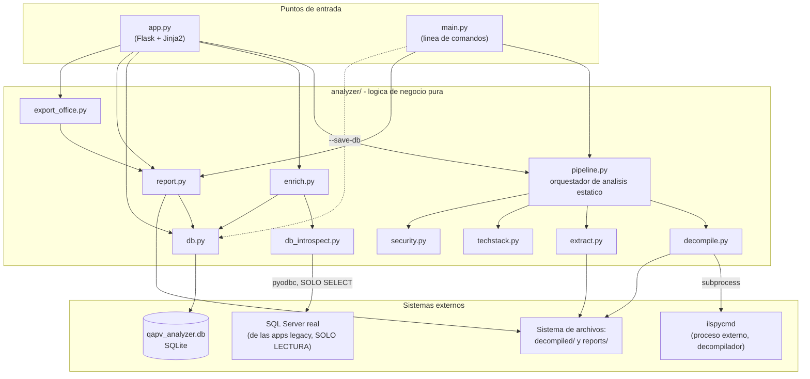
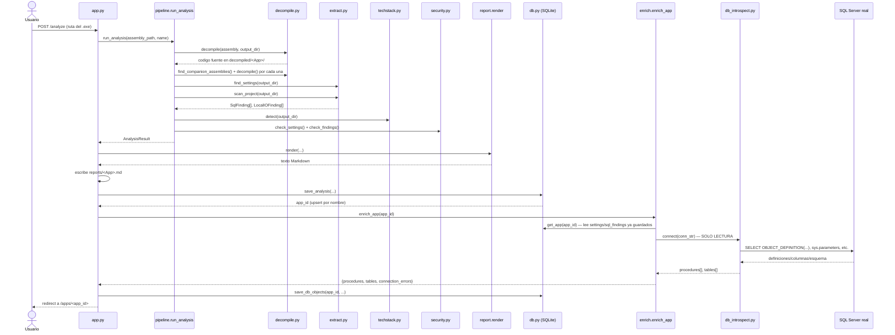
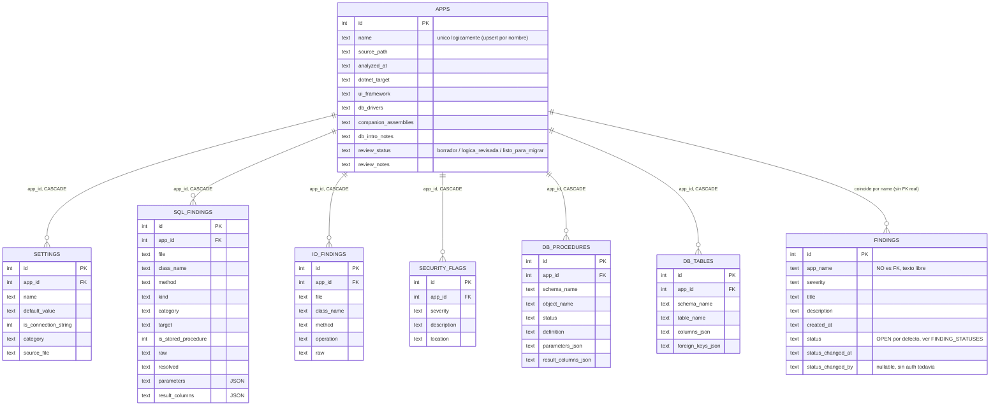
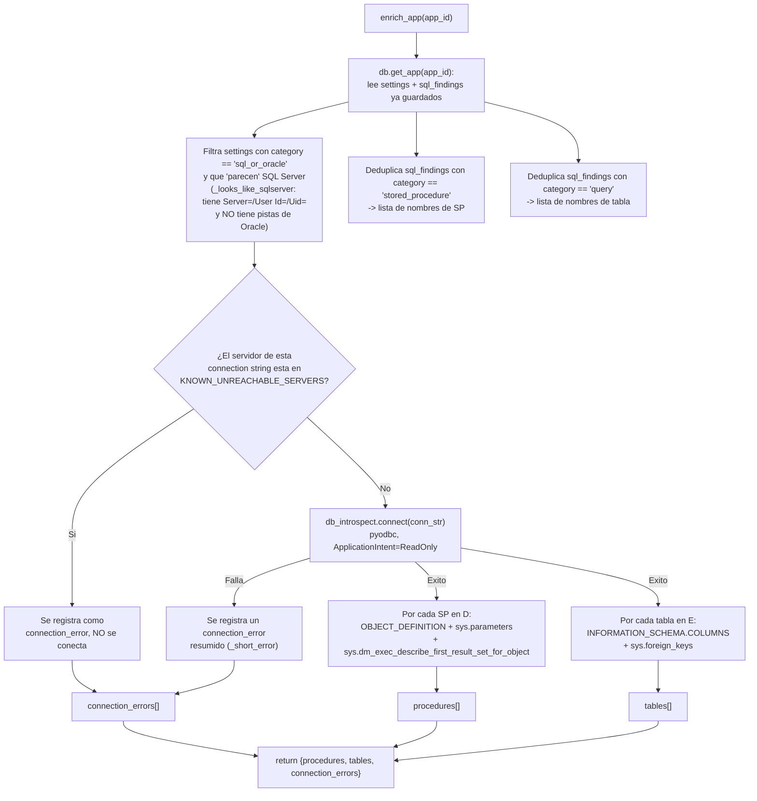
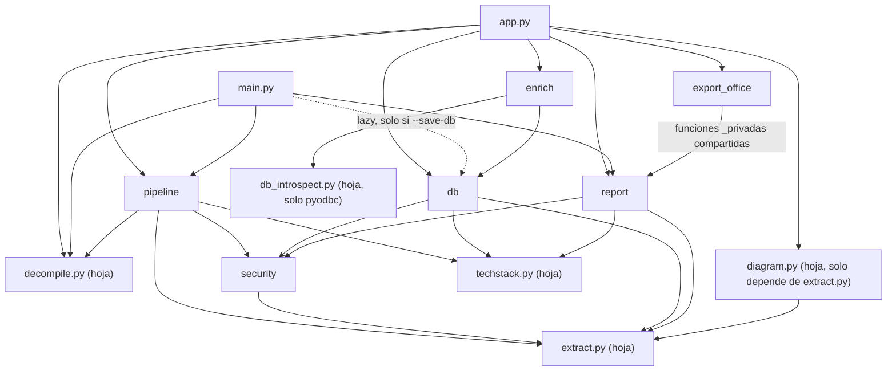

# Arquitectura de QAPV Legacy App Analyzer

Documento técnico dirigido **exclusivamente a desarrolladores** que vayan a mantener, extender o depurar este proyecto. Describe únicamente lo que existe hoy en el código — no hay funcionalidades aspiracionales aquí, esas viven en la sección [Roadmap Técnico](#roadmap-técnico) y en `README.md`.

> **Decisiones de arquitectura formales**: cambios importantes al diseño descrito aquí se registran como Architecture Decision Records en `adr/` (ver `adr/0000-application-identity.md` en adelante), apoyados en los principios consolidados en `ARCHITECTURAL_PRINCIPLES.md`. Cuando un ADR aprobado todavía no está implementado, este documento lo señala explícitamente en la sección afectada — el resto del texto sigue describiendo el comportamiento real del código, no el destino planeado.

---

# Arquitectura General

El proyecto es una aplicación **monolítica de proceso único**, sin microservicios, sin colas de trabajo y sin capa de caché. Tiene dos puntos de entrada independientes (`app.py` para la interfaz web, `main.py` para la línea de comandos) que comparten exactamente la misma lógica de análisis a través del paquete `analyzer/`. No hay separación por capas en el sentido clásico (controller/service/repository) — la organización real es **por responsabilidad funcional**: cada módulo de `analyzer/` hace una sola cosa (decompilar, extraer, detectar stack, generar alertas, persistir, renderizar, exportar, introspeccionar BD) y `app.py`/`main.py` los orquestan en secuencia.

Puntos clave de la arquitectura:

- **Un solo proceso, sin estado compartido entre requests** más allá de lo que vive en `qapv_analyzer.db` (SQLite) y en el sistema de archivos (`decompiled/`, `reports/`).
- **Sin frontend SPA** — Jinja2 renderiza HTML en el servidor; el único JavaScript no trivial vive embebido en `templates/discover_results.html` e `templates/index.html` para el progreso en tiempo real vía `fetch()` a `/analyze_one`.
- **Un único punto de entrada a procesos externos**: `analyzer/decompile.py` es el único módulo que hace `subprocess.run(...)` (invoca `ilspycmd`).
- **Un único punto de entrada a bases de datos externas**: `analyzer/db_introspect.py` es el único módulo que abre conexiones `pyodbc` hacia SQL Server real.
- **Un único punto de entrada a la persistencia propia**: `analyzer/db.py` es el único módulo que ejecuta SQL contra `qapv_analyzer.db`.
- **Reproducibilidad del reporte**: tanto la vista en pantalla (`result.html`) como las tres exportaciones (`.md`/`.xlsx`/`.docx`) se generan siempre desde la misma reconstrucción de datos (`analyzer/report.py: reconstruct_from_db`), nunca desde caminos de código distintos.



---

# Organización del Proyecto

```
QAPV-LegacyAppAnalyzer/
├── app.py                 # Capa HTTP (Flask) — unico punto de entrada web
├── main.py                # Capa CLI — unico punto de entrada por linea de comandos
├── requirements.txt       # Dependencias Python declaradas
├── qapv_analyzer.db       # Base de datos SQLite (generada, gitignored)
├── analyzer/              # Paquete con TODA la logica de negocio, sin dependencia de Flask
├── templates/             # Vistas Jinja2 (solo usadas por app.py)
├── static/                # CSS servido por Flask (solo usado por app.py)
├── decompiled/            # Salida de ilspycmd por app (generado, gitignored)
└── reports/                # Reportes .md por app (generado, gitignored)
```

### Responsabilidad de cada carpeta

- **Raíz del proyecto**: contiene los dos puntos de entrada (`app.py`, `main.py`) y los artefactos generados (`qapv_analyzer.db`, `decompiled/`, `reports/`). No hay separación en `src/` — el paquete `analyzer/` vive directamente junto a los entry points.
- **`analyzer/`**: paquete Python puro, **sin ningún import de Flask** en ninguno de sus módulos (verificado — `Flask`, `render_template`, `request`, etc. solo aparecen en `app.py`). Esto significa que toda la lógica de análisis puede probarse o reutilizarse (por ejemplo desde un script o un notebook) sin levantar un servidor web. Es la capa que un desarrollador nuevo debe entender primero.
- **`templates/`**: plantillas Jinja2, cargadas por convención de Flask (`templates/` en la raíz del proyecto, sin configuración explícita de `template_folder`). Cada plantilla extiende `base.html` (layout mínimo) o `library_base.html` (layout con barra lateral de apps analizadas, agrupadas por familia vía `db.group_apps_for_sidebar()` — ver el componente `analyzer/db.py`).
- **`static/`**: un único archivo (`style.css`), servido por la ruta estática por defecto de Flask (`/static/<filename>`). No hay build step (sin Sass/Less/bundlers) — es CSS plano.
- **`decompiled/`**: árbol de salida de `ilspycmd`, un subdirectorio por app (nombrado igual que `apps.name` en la base de datos, incluyendo la barra `/` de apps por lotes, p. ej. `decompiled/AFL.Dashboard/AFL.Scrap/`). Se regenera completo en cada re-análisis; no se versiona por tamaño.
- **`reports/`**: un archivo `.md` por app, con la misma convención de nombre/subcarpeta que `decompiled/`. No se versiona porque puede contener credenciales reales encontradas en el código legacy (ver [Seguridad](#seguridad)).

### Responsabilidad de cada módulo de `analyzer/`

| Módulo | Responsabilidad |
|---|---|
| `decompile.py` | Invocar `ilspycmd` como subproceso; descubrir ejecutables candidatos en una carpeta raíz; decidir qué DLLs "compañeras" decompilar. |
| `extract.py` | Analizar el código `.cs` ya decompilado con expresiones regulares: connection strings, hallazgos SQL (con parámetros y columnas de resultado), hallazgos de I/O local. Define los dataclasses `SettingEntry`, `SqlFinding`, `LocalIOFinding`. |
| `techstack.py` | Detectar framework .NET, UI (WinForms/WPF/Consola) y driver de base de datos a partir del código decompilado. Define `TechStack`. |
| `security.py` | Generar `SecurityFlag` a partir de los `SettingEntry`/`SqlFinding` ya extraídos (no vuelve a leer archivos). |
| `pipeline.py` | Orquestar decompile → extract → techstack → security en un único `AnalysisResult`. Es el **único punto de entrada** al análisis estático, usado tanto por `app.py` como por `main.py`. |
| `db_introspect.py` | Conectarse (solo lectura) a SQL Server real vía `pyodbc` y leer metadatos: definición de SP, parámetros formales, columnas de resultado, esquema de tablas, claves foráneas. |
| `enrich.py` | Orquestar `db_introspect.py` para una app ya analizada: decide qué connection strings usar, qué SPs/tablas buscar, y maneja errores de conexión por servidor. |
| `db.py` | Capa de persistencia SQLite completa: esquema, migraciones, upsert de análisis, CRUD de revisión de negocio y Hallazgos, búsquedas cruzadas. |
| `report.py` | Renderizar el análisis (desde memoria o reconstruido desde la BD) a Markdown; también expone las funciones de agrupado/deduplicado (`_group_by_method`, `_rows_for_method`) reutilizadas por `export_office.py`. |
| `diagram.py` | Generar el texto fuente de un diagrama Mermaid (flowchart) que resume, por clase, qué tablas/SPs/recursos de I/O toca cada app — a partir de los mismos `SqlFinding`/`LocalIOFinding` que ya produce `extract.py`. No genera ninguna imagen; el renderizado ocurre en el navegador. |
| `export_office.py` | Generar los bytes de `.xlsx` y `.docx` a partir de los mismos datos que `report.py` renderiza. |

---

# Flujo Interno

El pipeline completo, desde que el usuario envía el formulario hasta que el resultado queda persistido, pasa siempre por `app.py: _analyze_and_save()` (o su equivalente inline en `main.py: main()` para el CLI, que **no** incluye el paso de enriquecimiento — ver [Observaciones Técnicas](#observaciones-técnicas)).



**Fases, en orden:**

1. **Recepción de la solicitud** (`app.py`): valida que la ruta exista, resuelve si es un archivo directo o una carpeta con uno o varios ejecutables.
2. **Análisis estático** (`pipeline.run_analysis`): decompilación + extracción + detección de stack + alertas de seguridad. Devuelve un único objeto `AnalysisResult` en memoria — nada se persiste todavía en este paso.
3. **Renderizado y escritura del reporte** (`report.render` + escritura a disco): genera el Markdown y lo guarda en `reports/`.
4. **Persistencia del análisis** (`db.save_analysis`): guarda (o reemplaza, si el nombre ya existía) todo el resultado en `qapv_analyzer.db`.
5. **Enriquecimiento automático de BD** (`enrich.enrich_app` + `db.save_db_objects`): intenta conectarse (solo lectura) a las bases de datos reales usando las connection strings ya extraídas, y guarda lo que encuentre. Cualquier error se captura y se reporta, nunca interrumpe el flujo.
6. **Respuesta al usuario**: redirección a la vista de detalle de la app (`/apps/<id>`), que siempre relee desde la base de datos (nunca reutiliza el objeto en memoria del paso 2).

---

# Componentes

Para cada componente: responsabilidad, entradas, salidas y dependencias — tal como existen hoy en el código.

### `app.py`
- **Responsabilidad**: exponer toda la funcionalidad vía HTTP (Flask). Contiene únicamente lógica de request/response — nunca lógica de análisis propia. Define las rutas: `/`, `/analyze`, `/discover`, `/analyze_batch`, `/analyze_one`, `/apps/<id>`, `/apps/<id>/enrich`, `/apps/<id>/review`, `/apps/<id>/export/<fmt>`, `/apps/<id>/delete`, `/search`, `/findings`, `/findings/delete/<id>`, `/findings/status/<id>` (v0.5), `/portfolio` (v0.5).
- **Entradas**: formularios HTML (`request.form`), JSON (`request.get_json`, solo en `/analyze_one`), parámetros de ruta/query.
- **Salidas**: HTML renderizado (Jinja2), JSON (`/analyze_one`), archivos descargables (`/apps/<id>/export/<fmt>`), redirects con mensajes flash.
- **Dependencias**: `analyzer.db`, `analyzer.enrich`, `analyzer.export_office`, `analyzer.decompile` (solo `DecompileError`, `discover_assemblies`, `project_label`), `analyzer.pipeline` (`run_analysis`), `analyzer.report` (`reconstruct_from_db`, `render`, `render_from_db`), `markdown` (para convertir el reporte a HTML en pantalla), Flask.

### `main.py`
- **Responsabilidad**: equivalente de línea de comandos para un análisis puntual, sin servidor web.
- **Entradas**: argumentos de CLI (`assembly`, `--name`, `--save-db`) vía `argparse`.
- **Salidas**: reporte `.md` en `reports/`; opcionalmente una fila en `qapv_analyzer.db` (si se pasa `--save-db`); mensajes de progreso por `stdout`/`stderr`.
- **Dependencias**: `analyzer.decompile` (`DecompileError`), `analyzer.pipeline` (`run_analysis`), `analyzer.report` (`render`); importa `analyzer.db` de forma perezosa (dentro del `if args.save_db`) para no pagar el costo de abrir SQLite si no hace falta.
- **Diferencia importante con `app.py`**: **no llama a `enrich.py`** — el enriquecimiento de BD solo existe en el flujo web. Un análisis hecho por CLI con `--save-db` queda guardado sin definiciones de SP/tablas hasta que alguien lo abra en la interfaz web y use el botón "Reintentar extracción de BD".

### `analyzer/pipeline.py`
- **Responsabilidad**: único orquestador del análisis estático (decompilar → extraer → detectar stack → generar alertas de seguridad).
- **Entrada**: `assembly_path: Path`, `app_name: str | None`.
- **Salida**: `AnalysisResult` (dataclass) — nunca toca disco más allá de lo que `decompile()`/`find_settings()`/`scan_project()` ya hacen internamente, y nunca toca la base de datos.
- **Dependencias**: `decompile.py`, `extract.py`, `techstack.py`, `security.py`. No importa `db.py`, `report.py` ni `enrich.py` — deliberadamente ciego a cómo se persiste o presenta su resultado.

### `analyzer/decompile.py`
- **Responsabilidad**: único punto del proyecto que lanza un proceso externo (`ilspycmd`). También decide qué carpetas ignorar al descubrir ejecutables y qué DLLs se consideran "propias" (no de terceros).
- **Entrada**: rutas de archivo (`Path`).
- **Salida**: carpeta con el proyecto C# decompilado; lanza `DecompileError` si `ilspycmd` no está en el `PATH` o falla.
- **Dependencias**: solo librería estándar (`re`, `shutil`, `subprocess`) — sin dependencias de `analyzer/`.

### `analyzer/extract.py`
- **Responsabilidad**: todo el análisis léxico/regex del código `.cs` — la pieza con más lógica propia de todo el proyecto. Sigue manualmente la profundidad de llaves para aproximar límites de clase (`class_stack`) y de método (`_find_method_end`), sin usar un parser real de C#.
- **Entrada**: la carpeta con el código decompilado (`Path`).
- **Salida**: `list[SettingEntry]`, `tuple[list[SqlFinding], list[LocalIOFinding]]`.
- **Dependencias**: solo librería estándar (`re`, `dataclasses`, `pathlib`, `typing`). Es el módulo "hoja" del que dependen casi todos los demás.

### `analyzer/techstack.py`
- **Responsabilidad**: heurísticas de detección de framework .NET/UI/driver de BD a partir de patrones en `.csproj` y `.cs`.
- **Entrada/Salida**: `Path` → `TechStack`.
- **Dependencias**: solo librería estándar.

### `analyzer/security.py`
- **Responsabilidad**: convertir hallazgos ya extraídos en `SecurityFlag` (no vuelve a tocar el sistema de archivos).
- **Entrada**: `list[SettingEntry]`, `list[SqlFinding]`.
- **Salida**: `list[SecurityFlag]`.
- **Dependencias**: `extract.py` (solo para los tipos).

### `analyzer/db_introspect.py`
- **Responsabilidad**: el único módulo con permiso de abrir una conexión a una base de datos externa real. Toda función expuesta es una consulta de metadatos (`sys.*`, `INFORMATION_SCHEMA.*`) o `OBJECT_DEFINITION` — nunca una operación de escritura ni la ejecución de un SP.
- **Entrada**: connection string en formato .NET, esquema/nombre de objeto.
- **Salida**: definiciones/columnas como `dict`/`list[dict]`, o `None` cuando SQL Server no puede determinar algo estáticamente.
- **Dependencias**: `pyodbc` (externa) — sin dependencias internas de `analyzer/`.

### `analyzer/enrich.py`
- **Responsabilidad**: decidir, para una app ya analizada, **qué** connection strings/SPs/tablas buscar (a partir de lo ya guardado en `qapv_analyzer.db`) y delegar el **cómo** a `db_introspect.py`. Contiene la lista `KNOWN_UNREACHABLE_SERVERS` para saltarse servidores confirmados caídos.
- **Entrada**: `app_id: int`.
- **Salida**: `dict` con `procedures`, `tables`, `connection_errors`.
- **Dependencias**: `db.py` (para leer el análisis existente), `db_introspect.py`.

### `analyzer/db.py`
- **Responsabilidad**: único módulo que ejecuta SQL contra `qapv_analyzer.db`. Define el esquema completo, sus migraciones incrementales, y todas las operaciones CRUD/búsqueda. También incluye `group_apps_for_sidebar()`, que agrupa el resultado de `list_apps()` usando la convención de nombre `CarpetaRaiz/Modulo` (ver `app.py: _batch_name()`): una raíz con 2+ módulos analizados se agrupa en un `dict` de tipo `"group"` (con `reviewed_count`/`total_count` para el contador de progreso mostrado en la barra lateral); una raíz con un solo módulo se aplana de vuelta a un `dict` de tipo `"single"`, deduplicando el nombre visible cuando raíz y módulo son el mismo texto (ej. `ItemTrack/ItemTrack` → `ItemTrack`). Todo el resultado (grupos y apps sueltas) se reordena por el `analyzed_at` más reciente de cada uno, para conservar el mismo criterio de orden que `list_apps()`. Se recalcula en cada request (sin caché) — negligible en costo dado el volumen actual de apps, mismo criterio de rendimiento ya aplicado al diagrama de flujo de datos.
- **Entrada**: dataclasses de `extract.py`/`security.py`/`techstack.py`, o parámetros primitivos (ids, strings).
- **Salida**: `sqlite3.Row`/`dict`, o `int` (ids autogenerados). `group_apps_for_sidebar()` devuelve `list[dict]` heterogéneo (`kind: "group"` o `kind: "single"`), consumido por `templates/library_base.html`.
- **Dependencias**: `extract.py`, `security.py`, `techstack.py` (solo para los tipos de las funciones que reciben/devuelven). `get_dependency_graph()` importa `db_introspect.py` (solo `parse_dotnet_connection_string`, sin abrir ninguna conexión) para no duplicar el regex de parseo de connection strings.

**Read Models de portafolio (v0.5, ver `ARCHITECTURAL_PRINCIPLES.md` y `adr/0003-*.md`)**: `db.py` define dos vistas SQL de solo lectura (`VIEWS`, recreadas con `DROP`+`CREATE` en cada `init_db()` — una vista no admite `ALTER`, así que "migrar" una vista es simplemente redefinirla):
- `vw_table_dictionary` — una fila por `(tabla, app)`, consumida por `get_table_dictionary()`, que agrupa en Python por tabla y marca `schema_consistent=False` si dos apps reportan columnas distintas para la misma tabla (nunca oculta la discrepancia).
- `vw_dependency_graph` — aristas app↔app que comparten una tabla/SP (JOIN relacional puro). `get_dependency_graph()` la combina con aristas de servidor compartido, calculadas en Python (no en SQL, porque requieren parsear el connection string).

**Catálogo de patrones recurrentes** (`get_pattern_catalog()`, item 3 del orden de construcción de v0.5): agrupa `list_findings()` por categoría conocida (`PATTERN_CATEGORIES`, un `dict[str, re.Pattern]` con regex sobre título+descripción). Deliberadamente una heurística de palabras clave, no clustering semántico — igual de honesta sobre su propio límite que `extract.py` lo es sobre el suyo. Un hallazgo puede coincidir con varias categorías; el que no coincide con ninguna queda en `"Sin categorizar"`, visible, no oculto (Principio 3 de `ARCHITECTURAL_PRINCIPLES.md`). Validado contra los 95 hallazgos reales del inventario: 59% categorizado (credenciales en texto plano y código muerto son las categorías más frecuentes, consistente con lo ya observado cualitativamente durante las revisiones).

**Ciclo de vida de hallazgos**: `findings` ahora tiene `status` (`OPEN`/`ACKNOWLEDGED`/`RESOLVED`/`FALSE_POSITIVE`/`IGNORED`, ver `FINDING_STATUSES`), `status_changed_at`, `status_changed_by` (nullable — sin autenticación de usuarios todavía). `add_finding()` inserta siempre en `OPEN`; `set_finding_status()` es el único punto que lo cambia, validando contra `FINDING_STATUSES`. Deliberadamente un `status TEXT` con un conjunto cerrado de valores, no una columna booleana por estado (evita la proliferación de columnas que ya se veía venir con `resolved`/`acknowledged`/etc. como flags separados).

**WAL habilitado** (`PRAGMA journal_mode = WAL` en `get_conn()`, ver `adr/0003-*.md`): mejora la concurrencia lectura-mientras-escritura frente al modo rollback-journal anterior. No resuelve escritura-contra-escritura simultánea — ver ADR-0003 para el techo real y la política de evolución hacia un motor cliente-servidor si la contención persiste.

### `analyzer/report.py`
- **Responsabilidad doble**: (1) renderizar un análisis a Markdown, y (2) proveer las funciones de agrupado/deduplicado de hallazgos SQL (`_group_by_method`, `_rows_for_method`) que **también** usa `export_office.py`. Esta segunda responsabilidad hace que el nombre del módulo ("report") no cubra del todo lo que hace (ver [Observaciones Técnicas](#observaciones-técnicas)).
- **Entrada**: los mismos dataclasses que produce el pipeline, o un `dict` crudo desde `db.get_app()` (vía `reconstruct_from_db`).
- **Salida**: `str` (Markdown).
- **Dependencias**: `extract.py`, `security.py`, `techstack.py`.

### `analyzer/export_office.py`
- **Responsabilidad**: generar los bytes de `.xlsx` (`openpyxl`) y `.docx` (`python-docx`) reutilizando el mismo agrupado que usa el Markdown.
- **Entrada**: los mismos parámetros que `report.render`.
- **Salida**: `bytes`.
- **Dependencias**: `report.py` (funciones privadas `_group_by_method`/`_rows_for_method`), `openpyxl`, `python-docx`.

### `analyzer/diagram.py`
- **Responsabilidad**: convertir `SqlFinding[]`/`LocalIOFinding[]` en el texto fuente de un diagrama Mermaid (`flowchart LR`), agrupado por `class_name`: una arista por cada par (clase, tabla/SP/recurso de I/O) que la clase toca, deduplicando nodos de recurso compartidos entre varias clases. Categoriza los hallazgos de I/O por tipo (`_io_category()`: archivos, impresora, puerto serial, proceso externo, red) en vez de por ruta exacta, porque muchas rutas son expresiones C# dinámicas, no texto fijo. Corta el diagrama en `MAX_NODES` (80) nodos para evitar diagramas ilegibles en apps con muchos hallazgos (confirmado necesario: la app con más SPs del inventario actual, 162, satura ese límite y se trunca correctamente).
- **Entrada**: `list[SqlFinding]`, `list[LocalIOFinding]` (los mismos dataclasses que produce `extract.py`, en memoria o reconstruidos desde la BD).
- **Salida**: `str` con sintaxis Mermaid, o `None` si la app no tiene ningún hallazgo SQL/I-O (nada que dibujar). **No genera ninguna imagen ni HTML** — el renderizado real ocurre en el navegador vía `static/mermaid.min.js`, cargado únicamente en `result.html` cuando `dataflow_diagram` no es `None`.
- **Dependencias**: `extract.py` (solo para los tipos). Es, junto a `security.py`, uno de los módulos con menos acoplamiento del paquete.

### `templates/`
- **Responsabilidad**: presentación HTML únicamente; sin lógica de negocio (a lo sumo condicionales de Jinja2 sobre datos ya calculados en `app.py`).
- **Entrada**: contexto pasado por `render_template(...)` desde `app.py`.
- **Salida**: HTML.
- **Dependencias**: ninguna hacia `analyzer/` — solo reciben datos ya procesados.

### `static/`
- **Responsabilidad**: estilos CSS puros, sin JavaScript ni assets de build.
- **Dependencias**: ninguna.

---

# Flujo de Datos

Los datos cambian de forma varias veces entre la decompilación y la exportación final. Este diagrama muestra las transformaciones reales (no solo las llamadas a función):

```mermaid
flowchart LR
    A["Binario .exe/.dll"] -->|"ilspycmd (subprocess)"| B["Codigo fuente .cs<br/>(decompiled/&lt;App&gt;/)"]
    B -->|"extract.py: regex + brace-depth tracking"| C["Dataclasses en memoria:<br/>SettingEntry[], SqlFinding[], LocalIOFinding[]"]
    B -->|"techstack.py"| D["TechStack"]
    C -->|"security.py"| E["SecurityFlag[]"]
    C & D & E -->|"pipeline.py: ensambla"| F["AnalysisResult<br/>(un solo objeto en memoria)"]
    F -->|"report.render()"| G["str Markdown"]
    G -->|"write_text()"| H["reports/&lt;App&gt;.md"]
    F -->|"db.save_analysis()"| I[("Filas relacionales en<br/>qapv_analyzer.db")]
    I -->|"db.get_app()"| J["dict crudo<br/>(sqlite3.Row -> dict)"]
    J -->|"report.reconstruct_from_db()"| K["Los mismos dataclasses<br/>reconstruidos desde la BD"]
    K -->|"report.render()"| L["Markdown (pantalla / export .md)"]
    K -->|"export_office.build_xlsx()"| M["bytes .xlsx"]
    K -->|"export_office.build_docx()"| N["bytes .docx"]
    I -->|"enrich.enrich_app()"| O["procedures[], tables[]<br/>(desde SQL Server real)"]
    O -->|"db.save_db_objects()"| I
```



**Puntos clave del flujo de datos:**

- Después del análisis inicial, **todo dato mostrado al usuario se relee desde SQLite** — el objeto `AnalysisResult` en memoria del primer análisis se descarta una vez escrito a disco/BD; nunca se reutiliza directamente para la respuesta HTTP.
- `reconstruct_from_db()` es el único punto donde las filas de SQLite (`dict`s con JSON serializado en varias columnas: `parameters`, `result_columns`, `columns_json`, `foreign_keys_json`, etc.) vuelven a convertirse en los mismos dataclasses que el pipeline produjo originalmente — esto garantiza que `report.render()` no necesite dos implementaciones distintas según el origen de los datos.
- Los datos de enriquecimiento de BD (`db_procedures`, `db_tables`) viajan por un camino paralelo e independiente del análisis estático: se calculan después, a partir de lo ya guardado, y se guardan en tablas separadas.
- El diagrama de flujo de datos es una **vista derivada, calculada al vuelo en cada request** (`app.py: app_detail()` llama a `diagram.build_dataflow_diagram()` sobre los `sql_findings`/`io_findings` reconstruidos) — no se persiste en la base de datos ni se guarda como archivo; si el análisis subyacente cambia, el diagrama cambia solo en la siguiente carga de la página.

---

# Base de Datos

`qapv_analyzer.db` es un único archivo SQLite (`analyzer/db.py: DB_PATH`), accedido siempre a través de `get_conn()` (context manager que abre conexión, activa `PRAGMA foreign_keys = ON`, hace commit automático al salir sin excepción, y siempre cierra la conexión).

### Tablas y su propósito

| Tabla | Propósito | Relación |
|---|---|---|
| **`apps`** | Una fila por app analizada. Nombre, ruta de origen, fecha de análisis, stack tecnológico, ensamblados compañeros, estado de revisión de negocio, notas de conexión a BD. | Tabla raíz — todo lo demás cuelga de aquí (excepto `findings`). |
| **`settings`** | Cada `SettingEntry` encontrado (connection strings y otras configuraciones). | `app_id` → `apps.id`, `ON DELETE CASCADE`. |
| **`sql_findings`** | Cada `SqlFinding` (query/SP/paquete Oracle), con parámetros y columnas de resultado serializados como JSON en columnas `TEXT`. | `app_id` → `apps.id`, `ON DELETE CASCADE`. |
| **`io_findings`** | Cada `LocalIOFinding` (archivos, impresoras, procesos, red). | `app_id` → `apps.id`, `ON DELETE CASCADE`. |
| **`security_flags`** | Cada `SecurityFlag` generado. | `app_id` → `apps.id`, `ON DELETE CASCADE`. |
| **`db_procedures`** | Resultado de la introspección real de BD para un SP: definición completa, parámetros formales y columnas de resultado (JSON), estado (`ok`/`not_found`). | `app_id` → `apps.id`, `ON DELETE CASCADE`. |
| **`db_tables`** | Esquema real de cada tabla referenciada (columnas y FKs como JSON). | `app_id` → `apps.id`, `ON DELETE CASCADE`. |
| **`findings`** | Registro acumulativo de Hallazgos (bugs/riesgos confirmados durante la revisión manual). **Deliberadamente sin FK** — usa `app_name` (texto) en vez de `app_id`, para sobrevivir al ciclo de borrado+reinserción de `apps` (ver más abajo). | Vinculada a `apps` solo lógicamente, vía `LEFT JOIN ... ON a.name = f.app_name` en tiempo de lectura (`list_findings()`). |



### Por qué `findings` no tiene FK (decisión deliberada)

`save_analysis()` implementa el upsert como **`DELETE FROM apps WHERE name = ?` seguido de un `INSERT`** — es decir, re-analizar una app **le asigna un `id` nuevo**. Cualquier tabla hija con `ON DELETE CASCADE` sobre el `id` viejo se borra junto con esa fila. Para que un Hallazgo (una observación manual, cara de producir) no se pierda cada vez que alguien vuelve a correr el análisis de una app, `findings` se vincula por **nombre**, no por `id`, y sus lecturas hacen un `LEFT JOIN` en tiempo real contra la tabla `apps` actual (`db.list_findings()`) para seguir mostrando un link funcional. `review_status`/`review_notes` de `apps` resuelven el mismo problema de otra forma: se leen explícitamente **antes** del `DELETE` y se reinsertan a mano en el `INSERT` (ver `save_analysis()`).

> **Nota (2026-08-04)**: esta sección describe el diseño **actual**, todavía vigente en el código. Ya existe una decisión aprobada que lo va a reemplazar — ver `adr/0000-application-identity.md` y `adr/0001-preserve-app-identity-across-reanalysis.md`: la identidad de una app pasará a ser un `identity_id` estable e independiente de `name`/`source_path` (distinto del `id` autoincremental descrito aquí, que seguirá existiendo como clave técnica de fila), y `save_analysis()` dejará de recrear la fila en cada re-análisis. Cuando eso se implemente, esta sección debe actualizarse; mientras tanto, el comportamiento aquí descrito sigue siendo el real. `findings` seguirá referenciando por `app_name` hasta que se decida su convergencia a `identity_id` (ver "Consecuencias" de ADR-0000) — no es parte del alcance de ADR-0001.

### Índices

**No existen índices explícitos** en el esquema (`analyzer/db.py: SCHEMA`) más allá de la `PRIMARY KEY` autoincremental de cada tabla (que SQLite indexa automáticamente). En particular:

- Las columnas `app_id` de todas las tablas hijas **no tienen un índice explícito** — SQLite **no** crea automáticamente un índice sobre una columna de clave foránea, así que cada `SELECT ... WHERE app_id = ?` (usado en `get_app()`, `save_db_objects()`, etc.) hace un table scan completo de esa tabla.
- `findings.app_name` (usado en el `LEFT JOIN` de `list_findings()`) tampoco tiene índice.
- `apps.name` (usado en el `WHERE name = ?` del upsert de `save_analysis()`) tampoco tiene índice.

Con el volumen actual (decenas de apps, cientos de hallazgos por app) esto no es un problema de rendimiento perceptible, pero es la primera optimización obvia si el proyecto crece — ver [Recomendaciones Técnicas](#recomendaciones-técnicas).

### Migraciones

`init_db()` ejecuta el `SCHEMA` completo con `CREATE TABLE IF NOT EXISTS` (no destructivo) y luego aplica migraciones incrementales a mano, columna por columna, con `PRAGMA table_info(<tabla>)` + `ALTER TABLE ... ADD COLUMN` condicional. No hay un sistema de migraciones versionado (tipo Alembic) — cada columna nueva requiere agregar manualmente su bloque `if "<col>" not in existing_cols: conn.execute("ALTER TABLE ...")` dentro de `init_db()`.

---

# Pipeline de Ingeniería Inversa

Documentación fase por fase de cómo un binario se convierte en un reporte:

### 1. Descubrimiento
- **Dónde**: `analyzer/decompile.py: discover_assemblies()` / `project_label()`.
- **Qué hace**: recorre una carpeta raíz con `os.walk()`, **podando `dirnames` in-place** (nunca desciende a `obj/`, `.vs/`, `.git/`, `packages/`, ni a ninguna carpeta cuyo nombre empiece con `logs` — `_is_excluded_dir()`) y descartando `*.vshost.exe`, agrupando cada ejecutable por su carpeta de proyecto (la carpeta inmediatamente superior a `bin/`, con fallback al padre directo del `.exe`).
  - **Historial (2026-08-11)**: originalmente usaba `Path.rglob("*.exe")` y descartaba las carpetas excluidas *después* de recorrerlas por completo — sobre un share de red, eso significaba caminar todo `obj/`/`.git/`/`packages/` (potencialmente miles de archivos por SMB) antes de tirar el resultado. Un caso real (`GeoStatsInter`, cuyo `bin\Debug` además tenía carpetas de logs en tiempo de ejecución con tantos archivos que ni un listado no-recursivo terminaba en 180s) hacía que el escaneo pareciera colgado indefinidamente. `os.walk()` con poda evita entrar a esas carpetas en primer lugar.
- **Disparado por**: `app.py: /discover` (escaneo por lotes). El análisis de un único archivo (`/analyze`) no pasa por esta fase — solo resuelve si la ruta dada es un archivo o una carpeta con uno/varios candidatos directos (`p.glob("*.exe")`, no recursivo).

### 2. Decompilación
- **Dónde**: `analyzer/decompile.py: decompile()` + `find_companion_assemblies()`.
- **Qué hace**: verifica que `ilspycmd` esté en el `PATH` (`shutil.which`), lo invoca como subproceso (`ilspycmd -p -o <output_dir> <assembly>`), y adicionalmente decompila cualquier DLL hermana en la misma carpeta que no coincida con la lista de bloqueo de librerías de terceros conocidas (`THIRD_PARTY_ASSEMBLY_PATTERN`).
- **Entrada**: ruta del `.exe`/`.dll`.
- **Salida**: árbol de código fuente C# en `decompiled/<App>/`.
- **Manejo de error**: `DecompileError` si `ilspycmd` no existe, si el archivo no existe, o si el proceso termina con código distinto de 0 (incluye `stdout`/`stderr` completos en el mensaje).
- **Limpieza previa (2026-08-11, ver L28 en `KNOWN_LIMITATIONS.md`)**: `pipeline.py: run_analysis()` borra `output_dir` por completo (`shutil.rmtree`) antes de la primera llamada a `decompile()` de esa corrida, para que ningún archivo de un análisis anterior (con ese mismo `app_name`, o con un `app_name` distinto que por convención de rutas terminaba anidado dentro del mismo `output_dir`) se cuele en la extracción como si fuera parte de la corrida actual.

### 3. Análisis (detección de stack)
- **Dónde**: `analyzer/techstack.py: detect()`.
- **Qué hace**: busca `TargetFramework`/`TargetFrameworkVersion` en el primer `.csproj` encontrado; busca patrones de UI (`System.Windows.Forms`, `System.Windows.Controls`, `static void Main`) y de driver de BD (`System.Data.SqlClient`, `Microsoft.Data.SqlClient`, `Oracle.ManagedDataAccess`, `Oracle.DataAccess`) en todos los `.cs`.

### 4. Extracción SQL (y de I/O)
- **Dónde**: `analyzer/extract.py: scan_project()` → `scan_file()` por cada `.cs` (excepto los que tengan "Settings" en el nombre, que se procesan aparte en `find_settings()`).
- **Qué hace**: para cada línea, sigue la profundidad de llaves para saber en qué clase/método está posicionado (`class_stack`, `current_method`/`method_start_idx`); al encontrar un disparador SQL (`SQL_TRIGGER`) o de I/O (`LOCAL_IO_TRIGGER`), captura la sentencia completa (`_capture_statement`, balanceando paréntesis hasta el `;`), clasifica el tipo de SQL (`_classify_sql`: query / stored_procedure / oracle_package_call) y, si identifica la variable del comando, extrae parámetros (`_extract_parameters`) y columnas de resultado (`_extract_result_columns`) acotados al cierre real del método (`_find_method_end`).
- **Salida**: `list[SqlFinding]`, `list[LocalIOFinding]`.

### 5. Persistencia
- **Dónde**: `analyzer/db.py: save_analysis()`.
- **Qué hace**: upsert por `source_path` primero, por `name` si no hay match por `source_path` (borra la fila existente, preservando `review_status`/`review_notes`, y reinserta todo con el `name` ya existente en ese caso — nunca lo renombra). Serializa `parameters`/`result_columns` de cada `SqlFinding` como JSON antes de guardarlos (columnas `TEXT`).
  - **Por qué también por `source_path` (2026-08-11)**: el mismo `.exe` puede analizarse bajo dos `name` distintos según el flujo que lo dispare (`/analyze` directo al archivo vs. `/discover` por lotes, ver `app.py: _batch_name()`) — sin este chequeo, la segunda corrida creaba una fila `apps` nueva en vez de reemplazar la existente (confirmado con `GeoStatsInter`, que quedó duplicado además con hallazgos SQL/IO duplicados dentro de la fila nueva por la colisión de `output_dir` descrita en el paso 2). Ver `tests/test_save_analysis_dedup.py`.

### 6. Generación de reportes
- **Dónde**: `analyzer/report.py: render()`.
- **Qué hace**: arma el Markdown completo (tecnología, alertas, connection strings, tabla función→SQL, definiciones de SP/tablas si ya hay enriquecimiento, tabla de I/O).

### 7. Exportación
- **Dónde**: `analyzer/export_office.py: build_xlsx()` / `build_docx()`.
- **Qué hace**: misma información que el Markdown, reutilizando `report._group_by_method`/`_rows_for_method`, en formato Office.

> Nota: el **enriquecimiento de BD** (`enrich.py`/`db_introspect.py`) no es, estrictamente, una fase de "ingeniería inversa de código" — es una fase adicional e independiente que corre **después** de la persistencia (paso 5), sobre datos ya guardados. Se documenta en detalle en su propia sección: [Sistema de Enriquecimiento SQL](#sistema-de-enriquecimiento-sql).

---

# Sistema de Reportes

El reporte Markdown (`analyzer/report.py: render()`) es la **representación canónica** del análisis — tanto la vista en pantalla (`result.html`, convertida de Markdown a HTML vía la librería `markdown` con la extensión `tables`) como el archivo `.md` exportable usan literalmente la misma función.

- `render()` recibe los dataclasses ya calculados (o reconstruidos desde la BD vía `reconstruct_from_db()`) y devuelve un único `str`.
- La única diferencia entre "ver en pantalla" y "exportar `.md`" es si el resultado se pasa por `markdown.markdown(...)` (pantalla, en `app.py: app_detail()`) o se sirve tal cual con `Content-Disposition: attachment` (`app.py: export()`).
- No existe una capa de templating separada para el reporte (no usa Jinja2 para esta parte) — se arma concatenando líneas de texto (`lines: list[str]` + `"\n".join(lines)`), lo que hace el código más verboso pero evita cualquier dependencia entre el formato del reporte y el motor de plantillas de la web.

### Cómo agregar un nuevo formato de reporte

1. Si es un formato de **texto/documento** (como Word/Excel), seguir el patrón de `export_office.py`: una función `build_<formato>(app_name, tech, settings, sql_findings, io_findings, security_flags, companion_assemblies=None, db_procedures=None, db_tables=None) -> bytes`, reutilizando `report._group_by_method`/`_rows_for_method` para no reimplementar el agrupado.
2. Registrar el nuevo formato en `app.py: EXPORT_MIMETYPES` (clave = extensión, valor = MIME type).
3. Agregar una rama en `app.py: export()` que llame a la nueva función de construcción.
4. Si el formato necesita las tablas de introspección de BD (`db_procedures`/`db_tables`), asegurarse de aceptarlas como parámetros opcionales igual que `build_xlsx`/`build_docx` — no todas las apps tienen enriquecimiento exitoso.

---

# Sistema de Exportación

### Markdown (`.md`)
Es el formato "fuente": literalmente el mismo `str` que se muestra en pantalla, sin transformación adicional. Se sirve con `mimetype="text/markdown"`.

### Excel (`.xlsx`) — `export_office.build_xlsx()`
Usa `openpyxl.Workbook()`. Una hoja por sección (`Tecnologia`, `Seguridad`, `Conexiones y config`, `Funciones-SQL-SP`, `Archivos-Impresoras-Red`, y condicionalmente `Definiciones SP (BD)`, `Parametros SP (BD)`, `Columnas resultado SP (BD)`, `Esquema tablas (BD)`, `Claves foraneas (BD)` — estas últimas cinco solo se crean si hay datos, para no dejar hojas vacías). Al final, recorre todas las hojas y ajusta el ancho de columna según el contenido más largo (`min(max(length + 2, 12), 90)`).

### Word (`.docx`) — `export_office.build_docx()`
Usa `docx.Document()`. Estructura por encabezados (`Heading 1/2/3`) en vez de hojas separadas, con tablas de estilo `"Light Grid Accent 1"` (`_add_table()`, un helper local que crea la tabla, escribe el encabezado y una fila por elemento). El código fuente de cada Stored Procedure se agrega como un párrafo con fuente `Courier New` a 9pt.

### Cómo extender el sistema de exportación

- **Agregar una columna nueva a una tabla existente**: modificar la lista de headers y la lista de valores por fila en la función `build_*` correspondiente — ambos exportadores (y `report.render()`, si la columna también debe verse en pantalla/Markdown) deben tocarse a la vez para no desincronizar los tres formatos.
- **Agregar una sección completamente nueva**: replicar el patrón condicional ya usado para `db_procedures`/`db_tables` (`if db_procedures: ...` / `new_sheet(...)` o `doc.add_heading(...)`), para que la sección no aparezca vacía en apps que no tengan ese dato.
- **Agregar un formato nuevo**: ver la subsección anterior ([Sistema de Reportes](#sistema-de-reportes)).

---

# Sistema de Enriquecimiento SQL

Flujo completo de `analyzer/enrich.py: enrich_app(app_id)`, siempre **posterior** al análisis estático y siempre sobre datos ya guardados en `qapv_analyzer.db` (nunca vuelve a leer el código decompilado):



### Cómo detecta las conexiones a usar
`enrich_app()` **no vuelve a escanear código** — reutiliza los `settings` ya persistidos por el análisis estático, filtrando por `category == "sql_or_oracle"` (calculado originalmente en `extract.py: _classify_setting()`) y además `_looks_like_sqlserver()` (debe tener `Server=`/`User Id=`/`Uid=` y no debe tener pistas de Oracle como `Data Source=(` o `TNS`). Esto es deliberado: algunos `Settings.cs` decompilados nunca traen el atributo `[SpecialSetting(ConnectionString)]`, así que depender solo de esa marca dejaría connection strings reales sin detectar.

### Cómo obtiene los procedimientos
Para cada nombre de SP único (deduplicado sin distinguir mayúsculas/minúsculas, ya que SQL Server es case-insensitive por defecto): `db_introspect.get_procedure_definition()` (texto fuente vía `OBJECT_DEFINITION`), `get_procedure_parameters()` (firma formal vía `sys.parameters`/`sys.types`), `get_procedure_result_columns()` (columnas de salida vía `sys.dm_exec_describe_first_result_set_for_object`, que devuelve `None` — no error — cuando SQL Server no puede determinarlo estáticamente).

### Cómo obtiene las tablas
Para cada nombre de tabla único: `get_table_columns()` (`INFORMATION_SCHEMA.COLUMNS`) y, solo si sí devolvió columnas (evita marcar como "vista" algo que en realidad no existe o no es accesible), `list_foreign_keys()` (`sys.foreign_keys`/`sys.foreign_key_columns`).

### Garantía de solo lectura — cómo está implementada, no solo declarada
- `db_introspect.py` **no importa** ningún módulo de escritura SQL; cada función construye literalmente un `SELECT` fijo (con parámetros solo para los valores, nunca para los verbos SQL). No existe ninguna función en ese módulo que construya `INSERT`/`UPDATE`/`DELETE`/`EXEC` contra una base externa.
- El hint `ApplicationIntent=ReadOnly` en la cadena ODBC (`db_introspect.connect()`) es una **capa adicional de defensa en profundidad a nivel de servidor**, no el mecanismo principal — la garantía real es que el código simplemente nunca genera otra cosa que no sea `SELECT`.
- Un Stored Procedure **nunca se ejecuta**: su cuerpo se lee como texto plano vía `OBJECT_DEFINITION()`, una función de metadatos de SQL Server — en ningún punto del código hay un `{CALL ...}` o `EXEC`.
- `enrich_app()` solo **lee** de `qapv_analyzer.db` (vía `db.get_app()`) antes de conectarse a la BD externa, y solo **escribe** en `qapv_analyzer.db` (vía `db.save_db_objects()`, llamado por `app.py`, no por `enrich.py` mismo) después — nunca escribe en la base de datos externa en ningún punto del flujo.

---

# Convenciones de Desarrollo

### Estilo del código
- **Python moderno con type hints obligatorios** en firmas de función, incluyendo la sintaxis de unión `X | None` y genéricos nativos `list[X]`/`dict[str, X]` (requiere Python 3.10+, ver `README.md`).
- **Dataclasses** (`@dataclass`) para todo objeto de dominio (`SqlFinding`, `LocalIOFinding`, `SettingEntry`, `SecurityFlag`, `TechStack`, `AnalysisResult`) — ninguno usa `frozen=True`, son mutables por convención aunque en la práctica se tratan como inmutables una vez creados.
- **Funciones puras donde es posible**: la mayoría de `analyzer/*.py` son funciones que reciben datos y devuelven datos nuevos, sin efectos secundarios ocultos — las excepciones explícitas y aisladas son `decompile.py` (proceso externo), `db.py` (SQLite) y `db_introspect.py` (red).
- **Comentarios que explican el *por qué*, no el *qué***: el código tiene muy pocos comentarios, pero los que existen documentan restricciones no obvias o bugs ya corregidos (por ejemplo, el comentario de `_find_method_end()` explicando por qué un escaneo sin límite de método causaba atribución cruzada de columnas). Seguir este mismo criterio al agregar comentarios nuevos.
- **Prefijo `_` para funciones "privadas" del módulo** — con una excepción real: `export_office.py` importa `_group_by_method`/`_rows_for_method` directamente desde `report.py` a pesar del prefijo, porque son deliberadamente compartidas entre ambos módulos (ver [Observaciones Técnicas](#observaciones-técnicas)).

### Nomenclatura
- `snake_case` para funciones, variables y módulos; `PascalCase` para clases/dataclasses.
- Nombres de archivo/módulo en inglés (`decompile.py`, `enrich.py`); strings de cara al usuario (mensajes flash, texto de reportes, nombres de campos en Markdown) en **español**, consistente con el resto de la documentación del proyecto.
- Los nombres de apps por lotes siguen la convención `CarpetaRaiz/NombreDeModulo` (`app.py: _batch_name()`), usada como clave de upsert en `apps.name` (aunque desde 2026-08-11 `save_analysis()` primero intenta upsert por `source_path`, ver paso 5 del pipeline). **Excepción**: si `CarpetaRaiz` y `NombreDeModulo` son el mismo texto (una raíz con un solo proyecto, ej. `GeoStatsInter`), `_batch_name()` devuelve el nombre plano en vez de `"GeoStatsInter/GeoStatsInter"` — mismo criterio que `db.py: group_apps_for_sidebar()` ya usaba para *mostrar* este caso, aplicado ahora en el origen para evitar además la colisión de `output_dir` del paso 2 del pipeline.

### Cómo crear un nuevo módulo de análisis
1. Crear el archivo bajo `analyzer/`, sin importar Flask ni nada de `app.py`/`templates/`.
2. Si produce un nuevo tipo de hallazgo, definirlo como `@dataclass` (siguiendo el estilo de `SqlFinding`/`LocalIOFinding`).
3. Si debe correr como parte del análisis estático de cada app, conectarlo en `analyzer/pipeline.py: run_analysis()` y agregar el campo correspondiente a `AnalysisResult`.
4. Si debe persistirse, agregar la tabla/columnas necesarias en `analyzer/db.py` (schema + bloque de migración en `init_db()`) y extender `save_analysis()`/`get_app()`.
5. Si debe verse en los reportes, extender `analyzer/report.py: render()` y, si aplica, `analyzer/export_office.py`.

### Cómo agregar un nuevo analizador de patrones (regex) en `extract.py`
Seguir el patrón ya usado por `LOCAL_IO_TRIGGER`/`SQL_TRIGGER`: definir el regex como constante a nivel de módulo, agregar la rama correspondiente dentro de `scan_file()` (o una función nueva si la lógica es sustancialmente distinta), y — crítico — respetar los límites de método ya calculados (`method_start_idx`/`_find_method_end()`) si el nuevo análisis necesita "mirar hacia adelante" desde una línea disparadora, para no repetir el bug ya corregido de atribución cruzada entre métodos.

### Cómo agregar un nuevo motor de decompilación
Hoy **no existe una abstracción** para esto — `analyzer/decompile.py: decompile()` invoca `ilspycmd` de forma hardcodeada vía `subprocess.run([...])`. Para soportar un motor alternativo (por ejemplo, para un tipo de aplicación distinto a .NET), la forma menos invasiva de hacerlo sería:
1. Extraer una interfaz mínima (por ejemplo, una función `decompile(assembly_path, output_dir) -> Path` con la misma firma) y mover la implementación actual a algo como `decompile_dotnet_ilspy(...)`.
2. Decidir en `pipeline.py: run_analysis()` (o en el llamador) qué implementación usar, por ejemplo según la extensión del archivo de entrada.
3. Mantener la excepción `DecompileError` como el contrato de error común, para no tener que cambiar el manejo de errores en `app.py`/`main.py`.

### Cómo agregar un nuevo exportador
Ver [Sistema de Reportes](#sistema-de-reportes) y [Sistema de Exportación](#sistema-de-exportación) arriba — el patrón ya está bien establecido (función `build_<formato>` con la misma firma, registrar mimetype, agregar rama en `app.py: export()`).

---

# Extensibilidad

Puntos de extensión reales del código, en orden de qué tan preparado está hoy el proyecto para cada uno:

- **Nuevo tipo de hallazgo de análisis estático** (por ejemplo, detectar uso de un framework de logging, o de un tipo de hardware nuevo): el punto de extensión mejor preparado — solo requiere tocar `extract.py` (o un módulo nuevo) + `pipeline.py` + `db.py` + `report.py`/`export_office.py`, siguiendo el patrón ya usado por `LocalIOFinding`.
- **Nuevo formato de exportación**: bien preparado — `report.py`/`export_office.py` ya comparten el agrupado de datos, solo falta la función de construcción del nuevo formato.
- **Nuevo motor de base de datos para introspección** (Oracle): parcialmente preparado — `enrich.py` ya separa "qué connection strings/objetos buscar" de "cómo consultarlos", pero `db_introspect.py` está escrito específicamente contra la sintaxis de catálogos de SQL Server (`sys.*`); soportar Oracle requeriría un módulo paralelo (`db_introspect_oracle.py` o similar) y una rama en `enrich.py` que decida cuál usar según el driver detectado.
- **Nuevo motor de decompilación**: el menos preparado — no hay ninguna capa de abstracción hoy, `ilspycmd` está hardcodeado (ver convención arriba).
- **Multi-tenencia / multi-usuario sobre el mismo acumulado**: no preparado en absoluto — `qapv_analyzer.db` es un archivo SQLite local por instancia, sin ningún mecanismo de sincronización entre máquinas (ver `README.md`, sección de Limitaciones).

---

# Gestión de Errores

No existe una jerarquía de excepciones propia más allá de **una sola clase custom**: `DecompileError` (`analyzer/decompile.py`, subclase de `RuntimeError`), usada para cualquier fallo de la fase de decompilación (ejecutable no encontrado, `ilspycmd` ausente del `PATH`, o el proceso terminando con código distinto de cero).

Patrones de manejo de errores usados hoy:

| Origen del error | Cómo se maneja | Dónde |
|---|---|---|
| Falla de decompilación (`DecompileError`) | Capturada explícitamente en cada ruta de `app.py` (`/analyze`, `/analyze_batch`, `/analyze_one`) y en `main.py`; se muestra como mensaje flash (web) o se imprime a `stderr` con código de salida 1 (CLI). | `app.py`, `main.py` |
| Falla de conexión/consulta durante el enriquecimiento de BD | Capturada con `except Exception` **genérico** alrededor de `enrich.enrich_app(...)` en `app.py: _analyze_and_save()`, y convertida en un `connection_errors[]` que se muestra como mensaje informativo — nunca interrumpe el análisis. | `app.py`, `enrich.py` |
| Estado de revisión o severidad de Hallazgo inválidos | `ValueError` explícito lanzado por `db.set_review()`/`db.add_finding()` si el valor no está en la lista permitida (`REVIEW_STATUSES`/`FINDING_SEVERITIES`); capturado en `app.py: review_route()` y mostrado como flash. | `db.py`, `app.py` |
| App/hallazgo inexistente al navegar por id | Chequeo explícito (`if not data: flash(...); return redirect(...)`) en cada ruta que recibe un `id` — no se deja propagar una excepción de "no encontrado". | `app.py` |
| Cualquier otra excepción no capturada | Se propaga hasta Flask, que en modo `debug=True` (`app.run(debug=True, port=5000)`) muestra la página de error interactiva de Werkzeug con el traceback completo. | Comportamiento por defecto de Flask, no hay manejador de errores custom (`@app.errorhandler`). |

**Observación importante**: el `except Exception as e` alrededor de `enrich_app()` es intencional (ningún fallo de un servidor de BD debe tumbar el análisis), pero al ser tan amplio también absorbería un error de programación real dentro de `enrich.py`/`db_introspect.py` (por ejemplo un `AttributeError` por un cambio de esquema no contemplado) y lo mostraría al usuario como si fuera un simple "no se pudo conectar" — ver [Observaciones Técnicas](#observaciones-técnicas).

---

# Logging

**No existe un sistema de logging estructurado.** No hay ningún `import logging` en todo el proyecto (`app.py`, `main.py`, ni ningún módulo de `analyzer/`). Lo que existe hoy:

- **CLI (`main.py`)**: mensajes de progreso vía `print()` hacia `stdout`, y el mensaje de error de `DecompileError` vía `print(..., file=sys.stderr)`.
- **Web (`app.py`)**: comunicación de estado al usuario exclusivamente vía `flash()` de Flask (mensajes efímeros de una sola sesión/request), nunca escritos a un archivo ni a consola de forma estructurada.
- **Servidor de desarrollo**: al correr `app.run(debug=True)`, Werkzeug (el servidor WSGI de desarrollo de Flask) imprime su propio log de acceso HTTP a la consola (método, ruta, código de estado) — esto es un comportamiento por defecto de Flask, no algo configurado explícitamente por este proyecto.
- **Sin persistencia de logs**: no hay ningún archivo `.log`, no hay rotación, no hay niveles de severidad configurados (`DEBUG`/`INFO`/`WARNING`/`ERROR`).

### Mejoras posibles
- Introducir el módulo estándar `logging` (sin dependencias nuevas) al menos en los puntos donde hoy se usa `print()`/`flash()` para errores reales (fallos de decompilación, fallos de conexión a BD), para tener un rastro persistente independiente de si el usuario llegó a ver el mensaje flash.
- Diferenciar en el log el nivel de severidad real: un fallo de conexión a `naamrt-qcs11` (ya conocido y esperado) no debería tener la misma severidad de log que una excepción no prevista dentro de `enrich_app()`.
- Si el proyecto crece a varios operadores simultáneos, un log de auditoría de qué app se (re)analizó, cuándo y desde qué máquina sería valioso — hoy `apps.analyzed_at` es la única traza temporal, y se sobrescribe en cada re-análisis.

---

# Dependencias

### Internas (entre módulos del propio proyecto)



`extract.py`, `techstack.py`, `decompile.py` y `db_introspect.py` son los cuatro módulos "hoja" del proyecto — no dependen de ningún otro módulo interno, solo de la librería estándar (los tres primeros) o de `pyodbc` (el último). Esto los hace los más fáciles de probar de forma aislada. `diagram.py` es casi-hoja: depende únicamente de los tipos de `extract.py` (`SqlFinding`/`LocalIOFinding`), sin ninguna otra dependencia interna.

### Externas (paquetes de terceros)

| Paquete | Usado por | Propósito |
|---|---|---|
| **Flask** | `app.py` | Servidor web, ruteo, plantillas Jinja2, mensajes flash. |
| **Markdown** | `app.py` | Convertir el reporte Markdown a HTML para mostrarlo en pantalla. |
| **openpyxl** | `analyzer/export_office.py` | Generar archivos `.xlsx`. |
| **python-docx** | `analyzer/export_office.py` | Generar archivos `.docx`. |
| **pyodbc** | `analyzer/db_introspect.py` | Conectarse a SQL Server. **No está declarado en `requirements.txt`** — ver `README.md`. |

### Herramientas externas (no son paquetes pip)

| Herramienta | Usada por | Propósito |
|---|---|---|
| **`ilspycmd`** | `analyzer/decompile.py` (vía `subprocess`) | Decompilar el binario .NET a proyecto C#. |
| **ODBC Driver 17 para SQL Server** | `analyzer/db_introspect.py` (vía `pyodbc`) | Driver de sistema operativo requerido para que `pyodbc` pueda conectarse. |
| **SQLite** (`sqlite3`, librería estándar de Python) | `analyzer/db.py` | Motor de la base de datos acumulativa — sin instalación aparte. |
| **Mermaid.js** | `templates/result.html` (cargado como `<script>` en el navegador) | Renderiza el diagrama de flujo de datos que genera `analyzer/diagram.py`. Vendorizado como `static/mermaid.min.js` (descargado una vez desde jsDelivr) en vez de referenciado por CDN — es la **única** dependencia de terceros del proyecto que no vive en `requirements.txt` ni se instala con `pip`, sino como un archivo estático versionado a mano; si se actualiza la versión de Mermaid, hay que volver a descargar el archivo manualmente. |

---

# Seguridad

Decisiones de seguridad tal como están implementadas en el código (no solo declaradas):

- **Solo lectura contra bases de datos externas, por diseño arquitectónico**: `analyzer/db_introspect.py` es el **único** módulo del proyecto que abre una conexión `pyodbc`. Cada una de sus funciones construye un `SELECT` fijo contra catálogos de sistema (`sys.parameters`, `sys.types`, `sys.foreign_keys`) o `INFORMATION_SCHEMA.COLUMNS`, o llama a una función de metadatos de solo lectura (`OBJECT_DEFINITION`, `sys.dm_exec_describe_first_result_set_for_object`). No existe, en ningún módulo del proyecto, código que construya `INSERT`/`UPDATE`/`DELETE`/`ALTER`/`CREATE`/`DROP`/`EXEC` contra una base de datos externa. El hint `ApplicationIntent=ReadOnly` en la cadena de conexión (`db_introspect.connect()`) es una capa adicional, no el mecanismo principal.
- **No modifica archivos de las aplicaciones legacy**: `ilspycmd` se invoca en modo lectura sobre el binario (decompilación); en ningún punto del código se escribe de vuelta al `.exe`/`.dll` original ni a ningún archivo dentro de la carpeta de la app legacy — toda escritura ocurre exclusivamente dentro de `decompiled/`, `reports/` y `qapv_analyzer.db`, todos dentro del propio proyecto.
- **No ejecuta código de terceros**: el binario decompilado nunca se ejecuta — solo se lee su código fuente reconstruido como texto plano. `ilspycmd` en sí es la única herramienta de terceros que se invoca como proceso, y su única acción es leer el ensamblado y escribir archivos `.cs`.
- **Sin autenticación**: `app.py` no implementa login, sesiones de usuario ni control de acceso — cualquiera con acceso de red al puerto 5000 puede usar todas las funciones, incluida `/apps/<id>/delete`. `app.secret_key` es un valor fijo en el código, usado únicamente para firmar la cookie de mensajes flash (no protege ningún dato sensible ni sesión de usuario).
- **Exposición de credenciales reales como resultado esperado del análisis**: el propio propósito de la herramienta (detectar `Password=` en texto plano dentro de connection strings legacy, vía `analyzer/security.py`) implica que `reports/*.md` y `qapv_analyzer.db` **contendrán** credenciales reales de las aplicaciones legacy. Estos dos artefactos están excluidos de git (`.gitignore`) precisamente por esto — ver `README.md`.
- **`DEBUG=True` en el servidor Flask** (`app.run(debug=True, port=5000)`): expone el depurador interactivo de Werkzeug ante cualquier excepción no capturada, lo cual permite ejecución de código arbitrario desde el navegador si el puerto es alcanzable por alguien no autorizado. Aceptable únicamente porque el uso previsto es en `localhost` o una red interna de confianza — no debe desplegarse así en un entorno expuesto.

---

# Rendimiento

### Cómo está diseñado actualmente
- **Secuencial, sin paralelismo real**: tanto el análisis por lotes (el bucle `next(i)` en el JavaScript de `discover_results.html`, que llama a `/analyze_one` una vez a la vez y espera la respuesta antes de seguir) como `analyze_batch` (bucle `for` síncrono en `app.py`) procesan un ejecutable a la vez. Esto es intencional para el indicador de progreso, pero significa que el tiempo total de un lote es la suma del tiempo de cada app, no el máximo.
- **Sin caché de decompilación**: cada análisis vuelve a invocar `ilspycmd` y a re-escanear todos los `.cs` con regex desde cero, incluso si el binario de origen no cambió desde el último análisis. No hay ningún hash/mtime comparado contra un análisis previo.
- **Lectura completa de archivos en memoria**: `extract.py`/`techstack.py` usan `Path.read_text()` (carga el archivo entero) por cada `.cs`/`.csproj` — adecuado para el tamaño típico de estas apps legacy (WinForms/WPF de escritorio), no diseñado para codebases masivos.
- **SQLite de archivo único, sin pool de conexiones**: cada operación abre y cierra su propia conexión (`get_conn()` context manager) — correcto para el patrón de uso actual (una request HTTP a la vez, sin concurrencia real de escritura), pero no está pensado para muchos escritores simultáneos. Desde ADR-0003, `get_conn()` habilita `PRAGMA journal_mode = WAL`, que mejora la concurrencia lectura-mientras-escritura — no resuelve escritura-contra-escritura simultánea, ver ADR-0003 para el techo real y la política de evolución.
- **Sin índices en columnas de FK** (ver [Base de Datos](#base-de-datos)) — cada lookup por `app_id` es un table scan; irrelevante hoy por el volumen de datos, pero es el primer cuello de botella esperable si crece.
- **Diagrama de flujo de datos calculado en cada request, sin caché**: `diagram.build_dataflow_diagram()` recorre todos los `sql_findings`/`io_findings` de la app cada vez que se abre `/apps/<id>` — es una simple agregación en memoria (sin I/O), así que el costo es despreciable incluso en la app con más hallazgos del inventario actual (162 SPs). El límite `MAX_NODES = 80` no existe por costo de generación del texto, sino por costo de **renderizado en el navegador**: Mermaid se vuelve lento e ilegible bastante antes de los cientos de nodos.

### Posibles optimizaciones
- Paralelizar la decompilación de ensamblados "compañeros" (hoy secuencial en un bucle `for` dentro de `pipeline.run_analysis()`) — son procesos independientes entre sí.
- Cachear la decompilación por hash del binario de origen, para evitar re-invocar `ilspycmd` cuando el `.exe`/`.dll` no cambió.
- Agregar índices explícitos sobre las columnas `app_id` de las tablas hijas y sobre `findings.app_name`/`apps.name` si el volumen de apps/hallazgos crece significativamente.
- Si el análisis por lotes necesita ser más rápido en la práctica (no solo percibido como "no colgado"), considerar paralelizar `/analyze_one` con un límite de concurrencia, en vez de la cola estrictamente secuencial actual — implicaría rediseñar el indicador de progreso.

---

# Observaciones Técnicas

Hallazgos concretos de revisar el código completo, sin exagerar ni inventar problemas que no están presentes:

- **Duplicación real entre `app.py` y `main.py`**: el bloque que renderiza el reporte y lo escribe a disco (`render(...)` → calcular `report_path` → `mkdir(parents=True, exist_ok=True)` → `write_text(...)`) está **copiado casi textual** entre `app.py: _analyze_and_save()` y `main.py: main()`. Si el formato de nombre de archivo o la codificación cambiaran, hay que recordar tocar ambos lugares. Candidato claro a extraerse a una función compartida (por ejemplo, en `pipeline.py` o un nuevo `analyzer/report_writer.py`).
- **Encapsulación cruzada entre `report.py` y `export_office.py`**: `export_office.py` importa `_group_by_method` y `_rows_for_method` — funciones con prefijo `_` (que por convención de Python señala "privado del módulo") — directamente desde `report.py`. Es una dependencia intencional y documentada, pero el prefijo `_` envía la señal contraria; sería más claro quitarles el guion bajo (hacerlas parte de la API pública de `report.py`) o moverlas a un tercer módulo neutral (p. ej. `analyzer/sql_rows.py`) del que ambos dependan.
- **Responsabilidad doble en `report.py`**: además de renderizar Markdown, el módulo es la única fuente de las funciones de agrupado que usa el exportador de Office — el nombre del archivo ("report") no comunica esta segunda responsabilidad. Renombrar o separar clarificaría la arquitectura.
- **Inconsistencia entre `app.py` y `main.py` respecto al enriquecimiento**: solo el flujo web ejecuta `enrich.enrich_app()` automáticamente; un análisis por CLI con `--save-db` queda sin definiciones de SP/tablas hasta que alguien lo reintente desde la interfaz web. No está documentado explícitamente en el propio CLI (`main.py --help` no lo menciona).
- **Manejo de errores demasiado amplio en el enriquecimiento**: el `except Exception as e` alrededor de `enrich.enrich_app(...)` en `app.py` no distingue entre un fallo de conexión esperado (servidor caído) y un error de programación real dentro de `enrich.py`/`db_introspect.py` — ambos terminan mostrándose igual, como un mensaje de "no se pudo conectar". Esto puede ocultar bugs reales del propio proyecto detrás de mensajes que parecen problemas de infraestructura.
- **Configuración de rutas dispersa**: `BASE_DIR`/`REPORTS_DIR` se calculan de forma independiente en `app.py` **y** en `main.py` (código duplicado), y `DECOMPILED_DIR`/`DB_PATH` se calculan por separado en `pipeline.py`/`db.py`. No hay un módulo central de configuración — cualquier cambio a la estructura de carpetas del proyecto requiere tocar varios archivos.
- **Sin índices en columnas de FK** (ya detallado en [Base de Datos](#base-de-datos) y [Rendimiento](#rendimiento)) — no es un problema hoy, pero es deuda técnica silenciosa.
- **Ninguna prueba automatizada**: no existe una carpeta `tests/` en el repositorio. La validación de cambios en `extract.py` (el módulo más complejo y con más lógica propia) depende hoy enteramente de re-analizar apps ya conocidas a mano y comparar el resultado — ver la sección de convenciones del `README.md`. Esto es un riesgo real para cualquier refactor futuro del extractor.
- **Acoplamiento fuerte, pero contenido, en `enrich.py`**: depende directamente de la forma exacta del `dict` que devuelve `db.get_app()` (por ejemplo, accede a `data["settings"]`, `data["sql_findings"]` con claves de string) en vez de recibir los dataclasses ya tipados — un cambio en la forma del diccionario de `db.get_app()` podría romper `enrich.py` sin que el tipado (`dict` genérico) lo detecte en tiempo de análisis estático.
- **No hay código muerto evidente** dentro de `analyzer/` — todas las funciones revisadas tienen al menos un punto de llamada real en el flujo actual (verificado módulo por módulo durante esta revisión).
- **Lista de servidores no disponibles hardcodeada** (`KNOWN_UNREACHABLE_SERVERS` en `enrich.py`) — funcionalmente correcta hoy, pero cualquier cambio de infraestructura (un servidor que se recupera, uno nuevo que se cae) requiere un cambio de código y redeploy, no solo un cambio de dato.
- **`static/mermaid.min.js` es una dependencia de terceros sin mecanismo de actualización**: al ser un archivo vendorizado a mano (no gestionado por pip/`requirements.txt`), no hay ningún proceso ni recordatorio para actualizarlo si aparecen versiones nuevas de Mermaid con mejoras o correcciones — queda congelado en la versión descargada el día que se agregó, indefinidamente, hasta que alguien lo note y lo reemplace manualmente.

---

# Roadmap Técnico

Propuesta técnica, derivada directamente de las observaciones anteriores y de las limitaciones ya documentadas en `README.md`, para las próximas iteraciones del proyecto:

1. **Centralizar configuración de rutas**: crear un único módulo (por ejemplo `analyzer/config.py`) con `BASE_DIR`, `REPORTS_DIR`, `DECOMPILED_DIR`, `DB_PATH`, importado desde `app.py`/`main.py`/`pipeline.py`/`db.py` en vez de recalcularlos cada uno por su lado.
2. **Extraer la escritura del reporte a una función compartida** (`analyzer/report.py: write_report(result) -> Path` o similar), eliminando la duplicación entre `app.py` y `main.py`.
3. **Agregar `pyodbc` a `requirements.txt`** — el fix de menor esfuerzo y mayor impacto en reproducibilidad de instalación.
4. **Introducir `logging` estándar**, empezando por los puntos donde hoy se usa `print()`/`flash()` para errores reales, con al menos dos niveles claros: información esperada (servidor conocido como caído) vs. error inesperado (excepción de programación).
5. **Diferenciar errores de conexión esperados de errores de programación** en `enrich_app()` — por ejemplo, capturar específicamente las excepciones de `pyodbc` en `enrich.py` (donde ya se sabe que representan fallos de conexión) en vez de un `except Exception` genérico en `app.py`.
6. **Agregar una suite mínima de pruebas** para `extract.py` (el módulo con más lógica propia y más riesgo de regresión silenciosa) usando fixtures de código C# de ejemplo — no requiere apps reales, solo snippets representativos de los patrones ya soportados (`CommandText` con SP, con query, con parámetros, con `reader["Col"]`).
7. **Añadir índices explícitos** sobre `app_id` en las tablas hijas y sobre `apps.name`/`findings.app_name`, antes de que el volumen de datos lo vuelva perceptible.
8. **Abstraer el motor de decompilación** detrás de una interfaz mínima, aunque `ilspycmd` siga siendo la única implementación por ahora — reduce el costo de un eventual soporte a otro tipo de aplicación.
9. **Soporte de introspección de solo lectura para Oracle**, siguiendo el mismo patrón arquitectónico que `db_introspect.py`/`enrich.py` ya establecen para SQL Server.
10. **Hacer configurable, sin tocar código, la lista de servidores conocidos como no disponibles** (por ejemplo, una tabla en `qapv_analyzer.db` o un archivo de configuración simple).
11. **Incluir el diagrama de flujo de datos en las exportaciones** — hoy solo existe en la vista web; para Word/Excel se podría incrustar como imagen (requeriría un renderizado headless de Mermaid en el servidor, ej. `mermaid-cli` vía Node, o generar el diagrama con una librería Python equivalente) en vez de simplemente pegar el texto fuente.
12. **Nivel de detalle configurable en el diagrama** (por clase vs. por método) — hoy el agrupado por clase es fijo; exponer un toggle en la UI para apps pequeñas donde el detalle por método sí sería legible.

---

# Recomendaciones Técnicas

Resumen priorizado de lo que un desarrollador nuevo debería atacar primero, de menor a mayor esfuerzo:

1. **Agregar `pyodbc` a `requirements.txt`** (minutos) — hoy una instalación limpia según las propias instrucciones del README no funciona sin este paso manual.
2. **Extraer la lógica duplicada de escritura de reportes** entre `app.py` y `main.py` (menos de una hora) — riesgo bajo, beneficio inmediato de mantenibilidad.
3. **Quitar el prefijo `_` (o mover a un módulo compartido) a `_group_by_method`/`_rows_for_method`** — puramente cosmético, pero evita que un desarrollador nuevo asuma erróneamente que son privadas de `report.py` y duplique su lógica en vez de reutilizarlas.
4. **Diferenciar en `enrich_app()` los errores de conexión de los errores de programación** — importante antes de que el proyecto tenga más colaboradores tocando `enrich.py`/`db_introspect.py`, para no ocultar bugs reales detrás de mensajes de "no se pudo conectar".
5. **Escribir al menos pruebas de caracterización para `extract.py`** antes de cualquier refactor de ese módulo — es el de mayor complejidad ciclomática y el que más se ha corregido por bugs sutiles (atribución cruzada de columnas/parámetros entre métodos, ya corregido dos veces según el historial del proyecto).
6. **Documentar en `main.py --help` (o en el propio código) que el CLI no ejecuta el enriquecimiento de BD** — para que quien lo use no asuma que obtiene el mismo resultado que el flujo web.

---

# Diagramas

Los diagramas de este documento, para referencia rápida:

- [Arquitectura General](#arquitectura-general) — diagrama de componentes de todo el sistema.
- [Flujo Interno](#flujo-interno) — diagrama de secuencia del pipeline completo, de request a persistencia.
- [Flujo de Datos](#flujo-de-datos) — cómo se transforman los datos entre fases.
- [Base de Datos](#base-de-datos) — diagrama entidad-relación de `qapv_analyzer.db`.
- [Sistema de Enriquecimiento SQL](#sistema-de-enriquecimiento-sql) — diagrama de flujo de la introspección de BD.
- [Dependencias](#dependencias) — grafo de dependencias internas entre módulos de `analyzer/`.
