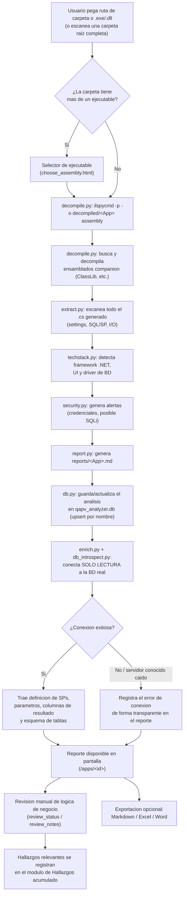

# QAPV Legacy App Analyzer

**Herramienta de ingeniería inversa y documentación automática para aplicaciones legacy .NET**, desarrollada para acelerar el inventario técnico de las ~55 aplicaciones de planta de QAPV_DATACENTER (AFL) en el marco del proyecto de migración a **Ignition MES**.

## Descripción breve

Decompila ejecutables `.exe`/`.dll` de Windows Forms/WPF/consola escritos en C#, extrae automáticamente sus conexiones a base de datos, consultas SQL, llamadas a Stored Procedures, integraciones locales (archivos, impresoras, puertos seriales, HTTP, procesos externos) y, opcionalmente, se conecta **en modo exclusivamente de lectura** a la base de datos real para traer la definición verdadera de cada Stored Procedure y el esquema de cada tabla. Todo el resultado se acumula en una base de datos propia, buscable, exportable a Markdown/Excel/Word y con un flujo de revisión manual para dar seguimiento a qué apps ya fueron auditadas y cuáles están listas para migrar.

## Objetivo

Reemplazar el proceso manual de "abrir dotPeek → decompilar clase por clase → copiar a un `.txt` → analizar a mano" — lento, propenso a omitir información (ensamblados referenciados, código dinámico, lógica repartida en varios proyectos) y no acumulativo — por un flujo automatizado, repetible y centralizado que cubra el ~80% del trabajo mecánico de cada app, dejando el criterio humano para lo que ningún analizador estático puede inferir: qué hace realmente la aplicación desde el punto de vista de negocio.

## Visión del proyecto

Servir como la **fuente única de verdad técnica** de todas las apps legacy de QAPV_DATACENTER durante el proyecto de migración: un lugar donde cualquier persona del equipo pueda buscar "¿qué apps usan la tabla `LCJob`?", "¿qué Stored Procedures llama `AFL.Dashboard`?" o "¿esta app ya fue revisada y está lista para migrar?", sin depender de documentos sueltos ni de la memoria de quien hizo el análisis original. No busca ser un producto genérico de reversing — está deliberadamente acoplado al formato y las convenciones ya usadas en el análisis manual previo de este proyecto.

> 📘 **¿Vas a dar mantenimiento a este código?** Este README está orientado a usuarios técnicos y a instalar/usar la herramienta. Para el diseño interno, el pipeline módulo por módulo, el modelo de datos y las convenciones para extenderla, ver **[ARCHITECTURE.md](ARCHITECTURE.md)**.

---

# Descripción General

### Qué hace la aplicación

QAPV Legacy App Analyzer toma la ruta de un ejecutable (o de una carpeta con varios), lo decompila con [`ilspycmd`](https://github.com/icsharpcode/ILSpy) reconstruyendo su proyecto C# completo, y analiza ese código fuente con un extractor propio basado en expresiones regulares (no un parser completo de C#, ver [Limitaciones actuales](#limitaciones-actuales)) para identificar:

- Cadenas de conexión a SQL Server / Oracle.
- Cada consulta SQL, llamada a Stored Procedure o paquete PL/SQL, junto con la clase/función donde vive, sus parámetros de entrada y las columnas de resultado que el código realmente consume.
- Accesos a archivos, carpetas, impresoras (incluye BarTender), puertos seriales, otros procesos (`Process.Start`) y llamadas de red (HTTP/SMTP).
- El stack tecnológico (framework .NET, UI — WinForms/WPF/consola —, driver de base de datos).
- Alertas de seguridad (credenciales en texto plano, posibles inyecciones SQL por concatenación de strings).

Adicionalmente, y siempre en **modo exclusivamente de lectura**, puede conectarse a la base de datos real usando las mismas cadenas de conexión encontradas para traer la definición íntegra de cada Stored Procedure (vía `OBJECT_DEFINITION`), su firma formal de parámetros y — cuando SQL Server puede determinarlo estáticamente — las columnas exactas que devuelve, además del esquema de las tablas referenciadas.

### Qué problema resuelve

Las apps legacy de planta no tienen documentación técnica actualizada. Antes de reemplazarlas por pantallas en Ignition MES hace falta saber, para cada una: a qué base de datos se conecta, qué tablas/SPs toca, qué reglas de negocio implementa y qué integraciones físicas (impresoras, hardware, otros sistemas) dependen de ella. Extraer esto a mano app por app —vía dotPeek y lectura manual— es lento y no deja rastro reutilizable. Esta herramienta automatiza la parte mecánica y dinamiza además la información que solo vive dentro de la base de datos (el cuerpo real de un Stored Procedure), algo que el código C# del cliente nunca expone por sí solo.

### Qué tipo de aplicaciones analiza

Ejecutables y librerías **.NET Framework/.NET** (WinForms, WPF o consola) compilados como `.exe`/`.dll`, típicamente ubicados en una carpeta `bin\Debug` o `bin\Release` dentro de `QAPV_DATACENTER`. No analiza aplicaciones web, no-.NET (por ejemplo el componente Python de `CentiServerMPO`/`ServerMPO`) ni binarios ofuscados.

### Para qué fue creada

Específicamente para el inventario de aplicaciones legacy de AFL previo a la migración a Ignition MES: dar cobertura rápida a decenas de apps ya identificadas en el inventario maestro del proyecto, sin sacrificar el nivel de detalle (SQL exacto, parámetros, definición real de SP) que ya se venía documentando a mano.

### Casos de uso

- Analizar una app puntual pegando la ruta de su `.exe`.
- Escanear de una sola vez la carpeta raíz de una solución con varios módulos (p. ej. `AFL.Dashboard` con 8+ proyectos hermanos) y elegir cuáles procesar.
- Buscar en qué apps aparece una tabla, Stored Procedure o servidor/base de datos específico, para entender el impacto de un cambio antes de tocarlo.
- Exportar el análisis de una app a Word/Excel para compartirlo con alguien que no use la herramienta.
- Registrar y consultar el estado de revisión de lógica de negocio de cada app (borrador / revisada / lista para migrar).
- Consultar el registro acumulativo de "Hallazgos" (bugs y riesgos reales confirmados) sin tener que abrir el reporte completo de cada app.

### Beneficios

- **Cobertura rápida**: cubre en minutos el ~80% del trabajo mecánico de mapear conexiones/SQL que antes tomaba horas por app.
- **No se pierde información**: decompila también ensamblados "compañeros" referenciados (p. ej. una `ClassLib` separada), algo que el proceso manual con dotPeek pasó por alto más de una vez.
- **Verdad desde la base de datos**: el cuerpo real de un Stored Procedure y su esquema de tablas, no solo cómo el cliente cree que se comporta — esto ya reveló bugs reales invisibles desde el código C# (p. ej. un SP que es un stub muerto).
- **Acumulativo y buscable**: todo queda en una base SQLite consultable entre apps, no en archivos sueltos.
- **Trazable**: exportaciones a Markdown/Excel/Word siempre generadas desde los mismos datos guardados, nunca pueden desincronizarse entre sí.
- **Seguro por diseño**: nunca modifica las aplicaciones legacy ni escribe nada en las bases de datos de producción (ver [Seguridad](#seguridad)).

---

# Características

### 🔍 Descubrimiento de aplicaciones
- Análisis de un único ejecutable indicando su ruta directa o la carpeta que lo contiene.
- Si una carpeta tiene varios `.exe`/`.dll`, se muestra un selector antes de continuar.
- Escaneo recursivo de una carpeta raíz (`/discover`) para encontrar todos los `.exe` de una solución multi-proyecto (ignora `obj`, `.vs`, `.git`, `packages` y `*.vshost.exe`), agrupados por proyecto y con las builds `Debug` pre-seleccionadas.
- Análisis por lotes de los ejecutables seleccionados, uno a la vez, con nombre automático `CarpetaRaiz/NombreModulo` para que los módulos de una misma solución queden agrupados.

### 🛠️ Ingeniería inversa / Decompilación
- Decompilación completa a proyecto C# (no solo IL) usando `ilspycmd`, reconstruyendo la estructura de carpetas original (Views/ViewModels/Models en apps WPF/MVVM incluidos).
- Detección y decompilación automática de **ensamblados "compañeros"**: DLLs propias (no de terceros) que estén junto al `.exe` principal y que la app referencia — cubre el patrón repetido en este código base de separar la lógica de datos en una `ClassLib` aparte.
- Lista de bloqueo por nombre para no decompilar ni contaminar el análisis con librerías de terceros conocidas (`System.*`, `Microsoft.*`, `Newtonsoft*`, `Oracle.*`, `DevExpress.*`, etc.).

### 📊 Análisis de ensamblados (stack tecnológico)
- Framework .NET objetivo (`TargetFramework`/`TargetFrameworkVersion` del `.csproj`).
- Framework de interfaz: WinForms, WPF o Consola/Servicio.
- Driver de base de datos usado: `System.Data.SqlClient`, `Microsoft.Data.SqlClient`, `Oracle.ManagedDataAccess` u `Oracle.DataAccess`.

### 🗄️ Análisis SQL (estático, desde el código decompilado)
- Detección de cada `SqlConnection`/`OracleConnection`/`CommandText`/`SqlCommand`/`OracleCommand`.
- Resolución de la clase y función donde vive cada uso (con seguimiento de profundidad de llaves para no confundir clases anidadas).
- Clasificación automática en **query**, **stored_procedure** u **oracle_package_call**, incluyendo el nombre de tabla/SP/paquete cuando es identificable.
- Extracción de **parámetros** enviados a cada comando (`.Parameters.Add(...)`/`.AddWithValue(...)`), con tipo y expresión C# de origen.
- Extracción de las **columnas de resultado** que el código realmente lee (`reader["Columna"]`), acotada de forma precisa a los límites reales del método (evita atribuir columnas de un método distinto que reutiliza el mismo nombre de variable).
- Reconstrucción best-effort de queries armadas en variables string antes de asignarse a `CommandText`.

### 🌐 Análisis de I/O local e integraciones
- Archivos y carpetas (`File.*`, `Directory.*`, `StreamReader/Writer`, `FileStream`, `DirectoryInfo`).
- Impresoras, incluido BarTender (`PrintDocument`, `PrintDialog`, `PrinterSettings`, `BarTender.Application`, `.PrintOut`).
- Hardware serial (`SerialPort`).
- Otros procesos (`Process.Start`).
- Red: `HttpClient`, `WebClient`, `HttpWebRequest`, `WebRequest.Create`, `SmtpClient`.

### 🔐 Extracción de esquema real desde la base de datos (solo lectura)
- Conexión con las mismas cadenas de conexión ya encontradas en el código, usando `pyodbc` (ODBC Driver 17 para SQL Server) en modo `ApplicationIntent=ReadOnly`.
- Definición completa del Stored Procedure vía `OBJECT_DEFINITION()`.
- Firma formal de parámetros (nombre, tipo, longitud, si es de salida, si tiene default) vía `sys.parameters`/`sys.types`.
- Columnas de resultado reales vía `sys.dm_exec_describe_first_result_set_for_object` (análisis estático del plan de consulta — nunca ejecuta el SP).
- Esquema de columnas de cada tabla referenciada (`INFORMATION_SCHEMA.COLUMNS`) y sus claves foráneas (`sys.foreign_keys`).
- Este paso se ejecuta **automáticamente** como parte de cada análisis (ya no es un botón manual opcional); un botón de "reintentar" queda disponible por si la base no respondió en ese momento.
- Lista configurable de servidores conocidos como no disponibles (actualmente `naamrt-qcs11`) para saltarse el intento de conexión y no perder tiempo en cada análisis.
- Solo soporta **SQL Server** — ver [Limitaciones actuales](#limitaciones-actuales).

### 🛡️ Seguridad (detección de riesgos en el código analizado)
- Credenciales en texto plano dentro de connection strings.
- Valores de connection string que parecen placeholders sin configurar.
- Posible inyección SQL: queries armadas por concatenación de strings sin parámetros.

### 📄 Reportes
- Reporte Markdown por app con: tecnología, alertas de seguridad, connection strings, rutas locales configuradas, tabla función→SQL/SP (con parámetros y columnas de resultado), definiciones de SP y esquema de tablas extraídos de la base de datos, y tabla de accesos a archivos/impresoras/procesos/red.
- El mismo contenido se muestra en pantalla (convertido de Markdown a HTML) y se persiste como archivo `.md` en `reports/`.

### 📤 Exportaciones
- Markdown (`.md`), Excel (`.xlsx`) y Word (`.docx`), generados siempre a partir de los mismos datos guardados en la base (ver [Exportaciones](#exportaciones)).

### 🗃️ Base de datos acumulativa
- SQLite (`qapv_analyzer.db`) con upsert por nombre de app: re-analizar una app reemplaza su análisis anterior en vez de duplicarlo.
- Preserva el estado de revisión de lógica de negocio (`review_status`/`review_notes`) a través de re-análisis.
- Registro cruzado de "Hallazgos", independiente del ciclo de vida de cada app (sobrevive aunque la app se re-analice).

### 🔎 Búsquedas
- Buscar por nombre de tabla/Stored Procedure: qué apps lo usan y de qué forma.
- Buscar por servidor/base de datos (connection string): qué apps comparten una misma conexión.

### ✅ Revisión de lógica de negocio
- Estado de revisión por app (`borrador` / `logica_revisada` / `listo_para_migrar`) con notas libres, como paso obligatorio antes de considerar una app lista para migrar.
- Insignias visuales en el listado lateral según el estado.

### ⚠️ Registro de Hallazgos
- Página dedicada y acumulativa de riesgos/bugs confirmados durante la revisión de lógica de negocio, con severidad, app, ruta de origen y descripción — para no tener que reabrir cada reporte individual.

### ⏱️ Experiencia de uso en tiempo real
- Indicador de progreso con contador de segundos transcurridos y animación mientras se analiza una app individual o un lote, para dejar claro que el proceso sigue trabajando en análisis largos.

---

# Flujo General

Desde que el usuario pega una ruta hasta que obtiene su reporte, el flujo es siempre el mismo internamente (ya sea vía análisis individual, selección múltiple o el endpoint JSON del progreso en tiempo real):



**Paso a paso:**

1. El usuario pega una ruta en `index.html` (una app puntual) o en el formulario de escaneo (`/discover`, para una carpeta con varios proyectos).
2. Si se indicó una carpeta con múltiples ejecutables, se muestra un selector (`choose_assembly.html`) o, en el flujo de escaneo, la lista completa agrupada por proyecto (`discover_results.html`) con casillas para elegir cuáles procesar.
3. Por cada ejecutable elegido, `analyzer/pipeline.py` orquesta: decompilación (`ilspycmd`) → decompilación de ensamblados compañeros → extracción de settings/SQL/I-O → detección de stack tecnológico → generación de alertas de seguridad.
4. Se genera el reporte Markdown y se guarda en `reports/<App>.md`, y el resultado completo se persiste en `qapv_analyzer.db`.
5. Automáticamente (ya no requiere un clic aparte) se intenta la extracción de esquema real desde la base de datos, siempre en modo solo lectura; cualquier fallo de conexión se registra como una nota visible, nunca interrumpe el análisis.
6. El usuario ve el reporte completo en pantalla, puede exportarlo, buscar información cruzada con otras apps, y registrar el estado de su revisión manual de lógica de negocio y cualquier hallazgo relevante.

---

# Tecnologías utilizadas

### Dependencias declaradas en `requirements.txt`

| Librería | Versión instalada (venv actual) | Para qué se usa en este proyecto |
|---|---|---|
| **Flask** | 3.1.3 | Framework web que expone toda la interfaz (`app.py`): rutas, formularios, plantillas Jinja2, mensajes flash. |
| **Markdown** | 3.10.2 | Convierte el reporte generado internamente en Markdown a HTML (con la extensión `tables`) para mostrarlo en pantalla en `result.html`. |
| **openpyxl** | 3.1.5 | Genera el archivo de exportación `.xlsx` (`analyzer/export_office.py`), con una hoja por sección del análisis. |
| **python-docx** | 1.2.0 | Genera el archivo de exportación `.docx` (`analyzer/export_office.py`), con encabezados y tablas equivalentes a las del Excel/Markdown. |

### Dependencia usada en el código pero **no declarada** en `requirements.txt`

| Librería | Para qué se usa | Nota |
|---|---|---|
| **pyodbc** | `analyzer/db_introspect.py` la usa para conectarse a SQL Server en modo solo lectura y traer definiciones de SP/tablas. | Está instalada en el entorno virtual actual (`5.3.0`) y la app depende de ella en tiempo de ejecución, pero falta agregarla a `requirements.txt` — ver [Limitaciones actuales](#limitaciones-actuales). |

### Otras piezas del stack (no son paquetes pip)

- **`ilspycmd`** — CLI del decompilador [ILSpy](https://github.com/icsharpcode/ILSpy), instalado como *dotnet global tool*. Es la pieza que convierte IL/bytecode .NET de vuelta a un proyecto C# navegable; todo lo demás en este proyecto opera sobre ese código fuente reconstruido.
- **.NET SDK** — requerido únicamente para poder instalar y ejecutar `ilspycmd` (es una herramienta .NET), no para correr la aplicación Python en sí.
- **SQLite** (vía el módulo `sqlite3` de la librería estándar de Python, sin dependencia externa) — motor de la base de datos acumulativa `qapv_analyzer.db`. Se eligió por ser un solo archivo, sin servidor que administrar, suficiente para el volumen de datos de este proyecto (decenas de apps, no miles).
- **ODBC Driver 17 para SQL Server** — driver a nivel de sistema operativo que `pyodbc` necesita para poder hablar con SQL Server; no se instala vía pip, debe existir en la máquina.
- **OpenXML** (formato) — tanto `.xlsx` como `.docx` son en realidad contenedores ZIP con XML interno siguiendo el estándar Office Open XML; `openpyxl` y `python-docx` son las librerías que abstraen ese formato para que el proyecto no tenga que generarlo a mano.

---

# Requisitos

- **Sistema operativo**: Windows 10/11 — es el entorno real de uso (rutas de red UNC `\\servidor\recurso`, apps analizadas son ejecutables de Windows). El código Python en sí no usa APIs específicas de Windows, pero no ha sido probado ni está pensado para correr en Linux/macOS en este proyecto.
- **Python**: 3.10 o superior (el código usa sintaxis de unión de tipos `str | None` introducida en Python 3.10). Probado actualmente con **Python 3.13.3**.
- **.NET SDK** — necesario para instalar `ilspycmd` como global tool. No requiere permisos de administrador (puede instalarse en el perfil del usuario).
- **`ilspycmd`** instalado y accesible en el `PATH`:
  ```powershell
  dotnet tool install -g ilspycmd
  ```
- **ODBC Driver 17 (o superior) para SQL Server** instalado en el sistema, si se quiere usar la extracción automática de esquema desde la base de datos.
- **Acceso de red de solo lectura** a los servidores SQL Server que las apps legacy usan (mismo usuario/credenciales embebidos en sus propias connection strings), únicamente si se desea la extracción de esquema.
- Dependencias Python listadas en `requirements.txt` **más** `pyodbc` (ver nota en la sección anterior).

---

# Instalación

```powershell
# 1. Clonar el repositorio
git clone https://github.com/EduardoPizzano/QAPV-LegacyAppAnalyzer.git
cd QAPV-LegacyAppAnalyzer

# 2. Crear y activar un entorno virtual
python -m venv .venv
# Si PowerShell bloquea la ejecucion de scripts, habilitarla solo para este proceso:
Set-ExecutionPolicy -Scope Process -ExecutionPolicy RemoteSigned
.\.venv\Scripts\Activate.ps1

# 3. Instalar dependencias
pip install -r requirements.txt
pip install pyodbc   # necesario para la extraccion de esquema desde SQL Server; ver nota arriba

# 4. Instalar el .NET SDK (si no esta ya) y el decompilador ilspycmd
#    (ver https://dot.net para el instalador, o dotnet-install.ps1 para instalacion sin admin)
dotnet tool install -g ilspycmd
# Asegurarse de que %USERPROFILE%\.dotnet\tools este en el PATH

# 5. Ejecutar la interfaz web
python app.py
# Abre http://127.0.0.1:5000 en el navegador
```

### Uso por línea de comandos (alternativa a la interfaz web)

```powershell
python main.py "\\servidor\ruta\a\LaApp.exe"
python main.py "\\servidor\ruta\a\LaApp.exe" --name "NombrePersonalizado"
python main.py "\\servidor\ruta\a\LaApp.exe" --save-db   # ademas guarda en qapv_analyzer.db
```

El CLI (`main.py`) genera el mismo reporte Markdown que la interfaz web, pero **no** ejecuta automáticamente la extracción de esquema desde la base de datos (esa parte solo está integrada en el flujo de `app.py`) ni las exportaciones a Excel/Word.

---

# Configuración

No existe un archivo de configuración externo (`.env`, `config.py`, etc.) — la configuración vive directamente en el código como constantes, pensado para un uso de un solo operador en su propia máquina:

- **Base de datos**: ruta fija `qapv_analyzer.db` en la raíz del proyecto (`analyzer/db.py: DB_PATH`). Se crea automáticamente en el primer arranque (`db.init_db()`, llamado al importar `app.py`). Las migraciones de esquema (columnas agregadas en versiones posteriores) se aplican automáticamente vía `ALTER TABLE` al iniciar, sin perder datos existentes.
- **Carpeta `reports/`**: ruta fija relativa a la raíz del proyecto (`app.py: REPORTS_DIR`). Se crea sola (incluyendo subcarpetas para apps con nombre `Carpeta/Modulo`) la primera vez que se guarda un reporte.
- **Carpeta `decompiled/`**: código fuente decompilado de cada app, uno por subcarpeta (`analyzer/pipeline.py: DECOMPILED_DIR`). Puede ocupar bastante espacio; está excluida de git.
- **`templates/`**: plantillas Jinja2 estándar de Flask, cargadas automáticamente desde esa carpeta por convención — no requiere configuración adicional.
- **`static/`**: hoja de estilos (`style.css`), servida por la ruta estática por defecto de Flask (`/static/...`).
- **Servidores conocidos como no disponibles**: lista `KNOWN_UNREACHABLE_SERVERS` en `analyzer/enrich.py` (actualmente solo `naamrt-qcs11`) — para agregar o quitar un servidor de esta lista hace falta editar el código, no hay una pantalla de configuración para esto todavía.
- **Driver ODBC usado**: `"ODBC Driver 17 for SQL Server"`, valor por defecto del parámetro `driver` en `analyzer/db_introspect.py: connect()` — puede pasarse otro valor al llamar la función, pero no es configurable desde la interfaz web.
- **`app.secret_key`**: valor fijo en `app.py`, usado únicamente para firmar los mensajes flash de la sesión (no hay login ni datos sensibles de usuario en esta app).

---

# Estructura del Proyecto

```
QAPV-LegacyAppAnalyzer/
├── app.py                      # Aplicacion web Flask: todas las rutas HTTP
├── main.py                     # CLI equivalente (linea de comandos, sin enriquecimiento de BD)
├── README.md                    # Este documento (uso, instalacion, funcionalidades)
├── ARCHITECTURE.md              # Arquitectura interna, para desarrolladores
├── requirements.txt            # Dependencias Python declaradas
├── qapv_analyzer.db            # Base de datos SQLite acumulativa (generada, gitignored)
├── .gitignore
│
├── analyzer/                   # Paquete con toda la logica de analisis, sin dependencias de Flask
│   ├── __init__.py             # (vacio, solo marca el paquete)
│   ├── decompile.py            # Wrapper de ilspycmd + descubrimiento de ensamblados/companions
│   ├── extract.py              # Extraccion regex: settings, SQL/SP, I/O local
│   ├── techstack.py            # Deteccion de framework .NET / UI / driver de BD
│   ├── security.py             # Generacion de alertas de seguridad
│   ├── pipeline.py             # Orquesta decompile -> extract -> techstack -> security
│   ├── db_introspect.py        # Introspeccion SOLO LECTURA contra SQL Server (pyodbc)
│   ├── enrich.py               # Orquesta la introspeccion de BD para una app ya analizada
│   ├── db.py                   # Capa de persistencia SQLite (esquema, migraciones, CRUD)
│   ├── report.py               # Renderizador del reporte Markdown (usado en pantalla y export)
│   └── export_office.py        # Exportadores a Excel (.xlsx) y Word (.docx)
│
├── templates/                  # Plantillas Jinja2
│   ├── base.html                # Layout raiz (header, mensajes flash)
│   ├── library_base.html        # Layout con barra lateral (listado de apps + accesos)
│   ├── index.html                # Formulario de analisis individual + escaneo de carpeta raiz
│   ├── choose_assembly.html      # Selector cuando una carpeta tiene varios ejecutables
│   ├── discover_results.html     # Resultado del escaneo + progreso en tiempo real por lote
│   ├── result.html                # Reporte completo de una app + revision + exportaciones
│   ├── search.html                # Busqueda cruzada por tabla/SP o por conexion
│   └── findings.html              # Registro acumulativo de Hallazgos
│
├── static/
│   └── style.css               # Estilos de toda la interfaz (sin frameworks CSS externos)
│
├── decompiled/                  # Codigo fuente decompilado por app (generado, gitignored)
└── reports/                     # Reporte .md por app (generado, gitignored)
```

### Explicación de los módulos principales

- **`app.py`**: capa HTTP. No contiene lógica de análisis propia; siempre delega en `analyzer/*`. Define las rutas de análisis (`/analyze`, `/discover`, `/analyze_batch`, `/analyze_one`), visualización (`/apps/<id>`), acciones (`/apps/<id>/enrich`, `/apps/<id>/review`, `/apps/<id>/delete`), exportación (`/apps/<id>/export/<fmt>`) y las vistas cruzadas (`/search`, `/findings`).
- **`analyzer/pipeline.py`**: punto de entrada único a todo el análisis estático de una app; usado tanto por `app.py` como por `main.py`, así que ambos flujos siempre analizan exactamente igual.
- **`analyzer/decompile.py`**: única pieza que invoca un proceso externo (`ilspycmd`); toda la lógica de qué carpetas ignorar y qué ensamblados se consideran "propios" vive aquí.
- **`analyzer/extract.py`**: el corazón del análisis estático — un conjunto de expresiones regulares con seguimiento manual de profundidad de llaves para aproximar límites de clase/método sin un parser completo de C#.
- **`analyzer/db_introspect.py`**: el único módulo con permiso de abrir una conexión real a una base de datos de producción; su docstring declara explícitamente la invariante de solo-lectura y ninguna otra parte del código abre conexiones SQL fuera de este módulo.
- **`analyzer/enrich.py`**: capa de orquestación entre lo ya encontrado estáticamente (qué SPs/tablas/conexiones tiene una app) y `db_introspect.py` (cómo consultarlos).
- **`analyzer/db.py`**: toda la persistencia SQLite vive aquí; ninguna otra parte del código ejecuta SQL contra `qapv_analyzer.db` directamente.
- **`analyzer/report.py`** / **`analyzer/export_office.py`**: comparten las mismas funciones de agrupado/deduplicado (`_group_by_method`, `_rows_for_method`) para que el reporte en pantalla, el `.md`, el `.xlsx` y el `.docx` nunca puedan mostrar información distinta entre sí.

---

# Funcionalidades implementadas

| Funcionalidad | Estado | Descripción |
|---|---|---|
| Análisis de un ejecutable individual | ✅ Implementado | Vía ruta directa o selector cuando la carpeta tiene varios candidatos. |
| Escaneo recursivo de carpeta raíz (multi-proyecto) | ✅ Implementado | `/discover`, agrupado por proyecto, con Debug pre-seleccionado. |
| Análisis por lotes con progreso en tiempo real | ✅ Implementado | Vía `/analyze_one` + JS, con contador de segundos y animación. |
| Decompilación completa a proyecto C# | ✅ Implementado | Vía `ilspycmd -p`. |
| Decompilación de ensamblados "compañeros" | ✅ Implementado | Lista de bloqueo por nombre para excluir librerías de terceros conocidas. |
| Detección de stack tecnológico | ✅ Implementado | Framework .NET, UI (WinForms/WPF/Consola), driver de BD. |
| Extracción de connection strings | ✅ Implementado | Desde `Settings.cs`/`Settings.Designer.cs`. |
| Extracción de queries y Stored Procedures | ✅ Implementado | Con clasificación query/SP/paquete Oracle. |
| Extracción de parámetros de cada SP/query | ✅ Implementado | `.Parameters.Add`/`.AddWithValue`, con tipo y expresión de origen. |
| Extracción de columnas de resultado (lado cliente) | ✅ Implementado | Vía `reader["Columna"]`, acotado al método real. |
| Reconstrucción de SQL armado en variables | ⚠️ Parcial | Best-effort; SQL dinámico complejo (`string[] + Concat`) puede quedar sin resolver. |
| Detección de I/O local (archivos/impresoras/serial/procesos/red) | ✅ Implementado | Ver lista completa en [Características](#características). |
| Alertas de seguridad (credenciales, posible SQLi) | ✅ Implementado | Heurísticas basadas en patrones, no un analizador de seguridad exhaustivo. |
| Extracción de esquema real desde SQL Server (solo lectura) | ✅ Implementado | Automática en cada análisis; definición de SP, parámetros formales, columnas de resultado reales, esquema de tablas y FKs. |
| Extracción de esquema real desde Oracle | ❌ Pendiente | Se detecta el uso de Oracle en el código, pero `db_introspect.py` solo sabe conectarse a SQL Server. |
| Reporte Markdown | ✅ Implementado | Generado y mostrado en pantalla desde los mismos datos. |
| Exportación a Excel | ✅ Implementado | Una hoja por sección, con ajuste automático de ancho de columna. |
| Exportación a Word | ✅ Implementado | Tablas equivalentes a las del Excel/Markdown. |
| Base de datos acumulativa con upsert por nombre | ✅ Implementado | Re-analizar una app reemplaza su registro anterior. |
| Búsqueda cruzada por tabla/SP | ✅ Implementado | `/search?mode=table`. |
| Búsqueda cruzada por servidor/conexión | ✅ Implementado | `/search?mode=connection`. |
| Revisión de lógica de negocio con estado y notas | ✅ Implementado | `borrador` / `logica_revisada` / `listo_para_migrar`, preservado entre re-análisis. |
| Registro acumulativo de Hallazgos | ✅ Implementado | Independiente del ciclo de vida de cada app (sobrevive re-análisis). |
| Eliminar un análisis | ✅ Implementado | Borra la app y todo lo asociado (cascada) de la base. |
| Indicador de progreso en tiempo real | ✅ Implementado | Contador de segundos + animación, en análisis individual y por lotes. |
| Autenticación / control de acceso | ❌ Pendiente | La aplicación no tiene login; pensada para un solo operador o red interna de confianza. |
| Pruebas automatizadas | ❌ Pendiente | No existen tests unitarios/de integración en el repositorio todavía. |
| Corrección de colisión de nombres en descubrimiento por lote | ❌ Pendiente | Si dos `.exe` distintos quedan en la misma carpeta de proyecto, podrían recibir el mismo nombre calculado — conocido, no corregido (ver [Limitaciones actuales](#limitaciones-actuales)). |

---

# Exportaciones

Las tres exportaciones se generan siempre a partir de la **misma reconstrucción de datos** (`analyzer/report.py: reconstruct_from_db`), por lo que su contenido nunca puede desincronizarse entre sí ni respecto a lo mostrado en pantalla.

### Markdown (`.md`)
Texto plano con formato Markdown (tablas incluidas). Pensado para versionarlo, pegarlo en un wiki, o leerlo directamente. Contiene todas las secciones: tecnología, alertas de seguridad, connection strings, rutas locales, tabla función→SQL/SP (con parámetros y columnas de resultado), definiciones de SP y esquema de tablas extraídos de la base de datos, y tabla de I/O local.

### Word (`.docx`)
Mismo contenido que el Markdown, organizado con encabezados (`Heading 1/2/3`) y tablas con estilo `Light Grid Accent 1`. Pensado para compartir con alguien que necesite revisarlo/anotarlo fuera de la herramienta. El código fuente de cada Stored Procedure se incluye en fuente monoespaciada (`Courier New`).

### Excel (`.xlsx`)
Una hoja por sección: `Tecnologia`, `Seguridad`, `Conexiones y config`, `Funciones-SQL-SP`, `Archivos-Impresoras-Red`, y (solo si hay datos) `Definiciones SP (BD)`, `Parametros SP (BD)`, `Columnas resultado SP (BD)`, `Esquema tablas (BD)` y `Claves foraneas (BD)`. Ancho de columna ajustado automáticamente; celdas con texto multilínea (parámetros, definición de SP) usan salto de línea envuelto (`wrap_text`).

---

# Seguridad

Esta herramienta fue diseñada, desde su primera versión, bajo una restricción no negociable: **nunca alterar ninguna aplicación legacy ni ninguna base de datos de producción**. Concretamente:

- ❌ **No modifica** ejecutables ni DLLs de las aplicaciones legacy — solo los lee para decompilarlos (`ilspycmd` es de solo lectura sobre el binario original).
- ❌ **No modifica** el comportamiento en tiempo de ejecución de ninguna app legacy — nunca se ejecutan, solo se decompila su código estático.
- ❌ **No modifica** ninguna base de datos.
- ✅ Toda conexión a SQL Server (`analyzer/db_introspect.py`) es **exclusivamente de lectura**, reforzada con el hint `ApplicationIntent=ReadOnly` a nivel de conexión — aunque la garantía real es arquitectónica: ese módulo, por diseño, **nunca construye** nada que no sea `SELECT` contra catálogos de sistema (`sys.parameters`, `sys.types`, `sys.foreign_keys`, `INFORMATION_SCHEMA.COLUMNS`) o funciones de metadatos de solo lectura (`OBJECT_DEFINITION`, `sys.dm_exec_describe_first_result_set_for_object`).
- ✅ La extracción de Stored Procedures utiliza **únicamente consultas de metadatos** — la definición se lee como texto (`OBJECT_DEFINITION`), nunca se invoca el procedimiento.
- 🚫 **Nunca ejecuta `UPDATE`.**
- 🚫 **Nunca ejecuta `DELETE`.**
- 🚫 **Nunca ejecuta `INSERT`** contra ninguna base de datos externa (los `INSERT` que sí existen en el código son exclusivamente contra la base SQLite propia de la herramienta, `qapv_analyzer.db`, para guardar el resultado del análisis).
- 🚫 **Nunca ejecuta `ALTER`** contra ninguna base de datos externa (los `ALTER TABLE` que sí existen son migraciones del propio `qapv_analyzer.db`).
- 🚫 **Nunca ejecuta `DROP`.**
- 🚫 **Nunca ejecuta `EXEC`** — el cuerpo de un Stored Procedure se lee como texto, jamás se invoca.

El único propósito de conectarse a una base de datos real es **documentación e ingeniería inversa** — entender qué hace hoy el sistema, nunca modificarlo.

> ⚠️ Ten en cuenta que el análisis estático del código sí puede exponer, dentro de los reportes generados (`reports/*.md`, `qapv_analyzer.db`), credenciales reales en texto plano que ya existían embebidas en las aplicaciones legacy (esto es precisamente uno de los hallazgos de seguridad que la herramienta está diseñada para detectar). Por eso `reports/` y `qapv_analyzer.db` están excluidos de este repositorio — ver `.gitignore` — y deben tratarse como información sensible interna.

---

# Limitaciones actuales

De forma honesta, esto es lo que **todavía no** cubre la herramienta:

- **No es un parser completo de C#** — el extractor (`analyzer/extract.py`) usa expresiones regulares con seguimiento de profundidad de llaves como aproximación a límites de clase/método. Funciona muy bien en la práctica sobre este código base, pero no tiene la robustez de un compilador real.
- **SQL dinámico complejo** (por ejemplo `string[] strArray = {...}; string.Concat(strArray)`) puede quedar parcialmente resuelto o marcado como "revisar manualmente".
- **La introspección de base de datos solo soporta SQL Server** — Oracle se detecta en el código (driver usado, llamadas a paquetes PL/SQL), pero no hay extracción real de esquema/definiciones para Oracle todavía.
- **`pyodbc` no está declarado en `requirements.txt`** pese a ser una dependencia real de `analyzer/db_introspect.py` — hoy funciona porque está instalado manualmente en el entorno virtual, pero un `pip install -r requirements.txt` limpio no lo instalaría.
- **Colisión de nombres en el descubrimiento por lote**: si dos ejecutables distintos quedan en la misma carpeta de proyecto (por ejemplo un `.exe` viejo olvidado junto al actual), ambos calculan el mismo nombre `CarpetaRaiz/Proyecto` y el segundo análisis sobrescribe silenciosamente al primero en la base (upsert por nombre). Confirmado que esto ya ocurrió en la práctica con algunas apps de `AFL.Dashboard`; identificado pero no corregido.
- **No analiza aplicaciones que no sean .NET** — por ejemplo el componente Python (`waitress`/Apache) que lanza `CentiServerMPO`, fuera de alcance de esta herramienta por diseño.
- **Sin autenticación ni control de acceso** — pensada para un operador único o una red interna de confianza; no debe exponerse en una red no confiable tal cual está.
- **Sin pruebas automatizadas** — no hay carpeta de tests en el repositorio todavía.
- **SQLite de un solo archivo** — adecuado para el volumen actual (decenas de apps), pero no está pensado para escritura concurrente pesada desde varios usuarios/procesos al mismo tiempo. Hoy cada persona que clona el repositorio genera su propia base local vacía (ver nota más abajo).
- **Sin mecanismo de compartir el acumulado entre varios usuarios** — como `reports/` y `qapv_analyzer.db` están excluidos del repositorio (por contener datos sensibles), cada persona que clona el proyecto empieza desde cero; no existe hoy un flujo de sincronización de ese acumulado entre el equipo.
- **Lista de servidores conocidos como no disponibles hardcodeada** — `KNOWN_UNREACHABLE_SERVERS` en `analyzer/enrich.py` requiere editar código para actualizarse, no hay pantalla de configuración.
- **Sin exportación consolidada multi-app** — cada exportación (Markdown/Excel/Word) es de una app a la vez; no existe un reporte combinado de varias apps en un solo archivo.

---

# Roadmap

Basado en las limitaciones ya identificadas y en el trabajo pendiente conocido del proyecto:

- [ ] Agregar `pyodbc` a `requirements.txt` para que una instalación limpia funcione sin pasos manuales adicionales.
- [ ] Corregir la colisión de nombres en el descubrimiento por lote (por ejemplo, desambiguar por nombre de archivo cuando una carpeta de proyecto produce más de un ejecutable analizado).
- [ ] Soporte de introspección de solo lectura para Oracle (equivalente a `db_introspect.py` pero contra `Oracle.ManagedDataAccess`/vistas `ALL_*`/`USER_*`).
- [ ] Hacer configurable (sin editar código) la lista de servidores conocidos como no disponibles.
- [ ] Reconstrucción más robusta de SQL armado dinámicamente en múltiples variables/arrays.
- [ ] Mecanismo simple para compartir el acumulado (`qapv_analyzer.db`/`reports/`) entre varios usuarios del equipo sin pasar por el repositorio de código.
- [ ] Suite de pruebas automatizadas, al menos para el extractor (`analyzer/extract.py`, la pieza con más lógica propia) y las migraciones de `analyzer/db.py`.
- [ ] Completar el análisis de las ~40 apps restantes del inventario maestro del proyecto de migración.
- [ ] Exportación consolidada de varias apps en un solo archivo (por ejemplo, para revisión de todo un módulo/solución de una vez).
- [ ] Definir formalmente la licencia del proyecto.

---

# Contribución

Este proyecto está en uso activo por un equipo pequeño (actualmente el autor original más colaboradores designados). Mientras no exista un flujo de CI/CD formal, se recomienda:

> Antes de tocar código, lee **[ARCHITECTURE.md](ARCHITECTURE.md)** — documenta el pipeline interno módulo por módulo, el modelo de datos de `qapv_analyzer.db`, las convenciones de nomenclatura y cómo extender la herramienta (nuevos analizadores, exportadores, motores de decompilación).

### Ramas
- No trabajar directamente sobre `main`. Crear una rama por tarea/feature con un nombre descriptivo:
  ```powershell
  git checkout -b feature/nombre-corto-de-la-tarea
  git checkout -b fix/nombre-corto-del-bug
  ```
- Mantener las ramas de corta duración — fusionar y borrar en cuanto el cambio esté validado, para evitar que diverjan mucho de `main`.

### Commits
- Mensajes en español, en modo imperativo y describiendo el *por qué* además del *qué* cuando no sea obvio (por ejemplo: "Corrige atribución de columnas entre métodos que reutilizan `sqlDataReader`" en vez de solo "fix bug").
- Preferir commits pequeños y enfocados en un solo cambio lógico, en vez de un commit gigante que mezcle features distintas.
- No incluir nunca `qapv_analyzer.db` ni la carpeta `reports/` en un commit (ya están en `.gitignore` — revisar `git status` antes de un `git add -A` si se sospecha algo raro).

### Buenas prácticas específicas de este proyecto
- Cualquier cambio en `analyzer/db_introspect.py` debe preservar la invariante de solo-lectura documentada en su docstring — si una función nueva no es un `SELECT` contra catálogos de sistema o una función de metadatos, no pertenece a ese módulo.
- Al modificar el extractor (`analyzer/extract.py`), validar el cambio re-analizando al menos una app ya conocida y comparando que los hallazgos existentes no cambien inesperadamente (no hay tests automatizados todavía, así que esta verificación manual es la red de seguridad actual).
- Al agregar una columna nueva a una tabla de `analyzer/db.py`, agregar también su migración (`ALTER TABLE ... ADD COLUMN`) dentro de `init_db()`, nunca asumir que la base se puede recrear desde cero (ya tiene datos reales acumulados).

### Pull requests
- Describir claramente qué app(s) se usó para validar el cambio y qué se verificó.
- Si el cambio toca el formato del reporte (`report.py`/`export_office.py`), confirmar que Markdown, Excel y Word se generan consistentes entre sí.

---

# Historial de versiones

No se han etiquetado versiones formales (tags de git) todavía — el proyecto ha evolucionado de forma continua sobre `main`. Esta tabla queda preparada para futuras versiones etiquetadas:

| Versión | Fecha | Resumen de cambios |
|---|---|---|
| — | — | _Aún no se han definido versiones formales del proyecto._ |

---

# Preguntas Frecuentes

**¿La herramienta modifica las aplicaciones legacy que analiza?**
No. Solo las lee para decompilarlas. Nunca escribe, recompila ni altera ningún `.exe`/`.dll` original.

**¿Puede dañar la base de datos de producción?**
No. Toda conexión a una base de datos real es exclusivamente de lectura, tanto por diseño (el código nunca construye sentencias distintas a `SELECT`/metadatos) como reforzado con el hint `ApplicationIntent=ReadOnly`. Nunca se ejecuta un Stored Procedure, solo se lee su definición como texto.

**¿Qué pasa si la base de datos de una app no responde?**
El análisis igual se completa con normalidad; el fallo de conexión queda registrado como una nota visible en el reporte (`db_intro_notes`), nunca interrumpe ni hace fallar el resto del análisis.

**¿Por qué `reports/` y `qapv_analyzer.db` no están en el repositorio de git?**
Porque contienen información extraída directamente de las aplicaciones legacy, incluyendo credenciales reales en texto plano que ya existían embebidas en su código y nombres de servidores/infraestructura interna. Se excluyeron deliberadamente para no filtrar esos datos — ver [Seguridad](#seguridad).

**Si clono este repositorio, ¿voy a ver las apps que ya analizaron mis compañeros?**
No automáticamente. Como esos archivos no viajan por git, cada quien genera su propia base vacía al clonar y correr la herramienta. Ver [Limitaciones actuales](#limitaciones-actuales) para el estado de este punto.

**¿Puedo analizar aplicaciones que no sean .NET?**
No. La herramienta depende de `ilspycmd`, que solo decompila ensamblados .NET (IL). Aplicaciones en otros lenguajes (por ejemplo el stack Python de `ServerMPO`) quedan fuera de alcance.

**¿Qué hago si `ilspycmd` no se encuentra en el PATH?**
El error lo indica explícitamente con el comando exacto a correr: `dotnet tool install -g ilspycmd`, y recuerda verificar que `%USERPROFILE%\.dotnet\tools` esté en el `PATH`.

**¿Por qué a veces no se pueden determinar las columnas de resultado de un Stored Procedure?**
SQL Server no siempre puede describir estáticamente el resultado de un procedimiento (por ejemplo si usa SQL dinámico, tablas temporales o devuelve más de un result set) — en ese caso la herramienta lo indica claramente en vez de adivinar, y recomienda revisar el código del SP manualmente.

**¿La herramienta reemplaza la revisión manual de un analista?**
No. Cubre el trabajo mecánico (dónde está cada conexión/query) pero el criterio de negocio — por ejemplo, detectar que una app es una copia duplicada de otra, o que un flujo tiene un bug silencioso — requiere lectura humana (o asistida) del código, por eso existe el flujo explícito de revisión de lógica de negocio.

---

# Créditos

Desarrollado por [**EduardoPizzano**](https://github.com/EduardoPizzano) como parte del proyecto de migración de aplicaciones legacy de planta a Ignition MES en AFL.

---

# Licencia

**Pendiente de definir.** Este proyecto todavía no tiene una licencia formal asignada. Hasta que se defina una, el uso y distribución del código quedan reservados a criterio del autor y de AFL.
