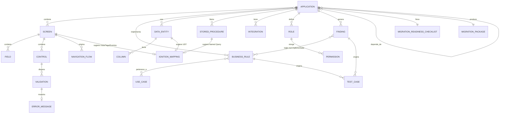

# Visión de Plataforma: de Analizador a Motor de Migración MES

**Rol asumido para este documento**: Principal Software Architect / Product Owner / Solution Architect (Ingeniería Inversa, Sistemas MES, Ignition, SQL Server/Oracle, Arquitectura Empresarial, Modernización de Software).

**Restricción respetada**: este documento es visión y arquitectura — cero código, cero implementación. Todo lo aquí propuesto está pendiente de tu aprobación.

**Documentos relacionados**: decisiones formales de arquitectura se registran en `adr/` (empezando por `adr/0000-application-identity.md`); los principios que las respaldan se consolidan en `ARCHITECTURAL_PRINCIPLES.md`. Este documento (`VISION.md`) se sincronizó por última vez con ambos el 2026-08-04 (ver `AUDIT-ARB-2026-08-04.md`).

**Premisa de partida**: *QAPV-LegacyAppAnalyzer* resuelve hoy, muy bien, "¿qué hace esta app legacy?". El problema real del negocio es distinto: "¿qué necesita un desarrollador de Ignition que **nunca vio la app legacy** para reconstruirla completa — datos y experiencia de usuario — sin perder conocimiento y sin repetir sus errores?". Este documento traza el camino de uno al otro, ya con las decisiones de negocio confirmadas por el equipo.

---

## 0. Decisiones de negocio confirmadas

Estas seis respuestas cambian sustancialmente el diseño respecto a la primera versión de este documento — no son matices, son restricciones de diseño reales.

**0.1 — Audiencia del paquete: cero conocimiento tácito asumido.** Cualquier desarrollador con experiencia en Ignition (no solo quien hizo el análisis) debe poder reconstruir la app usando *únicamente* lo que la herramienta genera. Esto eleva el estándar de todo lo demás en este documento: nada puede depender de "esto ya lo sabe quien migró" — todo debe quedar explícito, o la plataforma falla en su propósito central.

**0.2 — Convenciones de Ignition confirmadas.** Perspective como plataforma de UI, acceso a datos vía **Named Queries** (no SQL embebido en pantallas), lógica de negocio desacoplada del SQL directo, reutilización de componentes comunes siempre que sea posible. La herramienta debe ayudar a identificar, por app: **Named Queries necesarias, Vistas Perspective, Parámetros requeridos, Eventos, Navegación, Integraciones, Tags requeridos, UDTs cuando aplique.** Esto resuelve la incertidumbre que tenía el *Ignition Mapping Engine* en la versión anterior de este documento — ya no es especulativo, tiene un objetivo técnico concreto.

**0.3 — Priorización de migración basada en datos objetivos, no orden manual.** Se espera una recomendación con este formato:

> Aplicación A · Complejidad: Alta · Riesgo: Bajo · Dependencias: 4 · Prioridad: Alta

Factores confirmados: complejidad técnica, riesgo, dependencias compartidas, cantidad de usuarios, criticidad para la operación, cantidad de reglas de negocio, complejidad de integración, reutilización potencial. **Nota crítica que agrego yo**: de estos 8 factores, 6 son derivables del código (complejidad técnica, dependencias, reglas de negocio, complejidad de integración, riesgo vía severidad de hallazgos, reutilización potencial vía patrones repetidos entre apps). **Los otros 2 — cantidad de usuarios y criticidad operativa — no existen en ningún archivo `.cs`.**

> **Decisión del equipo (ajuste posterior)**: por ahora se omite la captura de estos 2 factores para no detener el avance. Se dejan explícitamente en manos de los analistas funcionales, quienes los completarán una vez tengan el resultado del análisis de cada app. El *Priority & Complexity Engine* de v0.5 arranca entonces con los **6 factores derivables del código**, y muestra los otros 2 como campos vacíos/pendientes de negocio — no bloquea la priorización, simplemente es honesto sobre qué parte de la recomendación es automática y cuál requiere criterio humano.

**0.4 — "Listo para Migrar" deja de ser un solo valor manual.** Se lleva desde un checklist objetivo (16 puntos, dados por el equipo: ingeniería inversa completada, código revisado, revisión funcional realizada, reglas de negocio documentadas, SPs documentados, modelo de datos documentado, dependencias identificadas, APIs identificadas, inventario de UI completado, casos de uso definidos, riesgos identificados, hallazgos críticos resueltos, validación con usuario de negocio realizada, especificación funcional aprobada, especificación técnica aprobada, blueprint de Ignition generado).

> **Decisión del equipo (ajuste posterior)**: la herramienta **llena y muestra** el checklist (qué puntos están cumplidos, con qué evidencia) — no calcula ni declara por sí sola un veredicto final de `READY FOR MIGRATION`. Son los analistas funcionales quienes deciden, viendo el checklist, si eso es *suficiente* para esa app en particular (puede haber apps donde 14/16 ya sea aceptable, y otras donde falte un punto crítico). Esto simplifica bastante lo que hay que construir: no es una capacidad de decisión automática, es un **tablero de seguimiento** — reemplaza igual al campo manual `review_status` de 3 valores, pero como una lista visible de evidencia, no como un semáforo automático.

**0.5 — UI: prioridad absoluta, con alcance más amplio del que yo proponía.** No es solo "inventario de campos" — es reconstruir la **experiencia de usuario** completa: pantallas, controles, navegación, validaciones, campos, botones, eventos, estados habilitado/deshabilitado, mensajes de error, flujo entre pantallas, ventanas modales, impresión, atajos de teclado, permisos, roles. El criterio de éxito lo definió el propio equipo: el desarrollador necesita saber **"¿qué debo construir?"**, no solo "¿qué Stored Procedure llama?".

**0.6 — Ritmo de evolución: incremental, con retorno inmediato obligatorio, sin bloquear el análisis en curso.** Esta es, en mi lectura, la regla más importante de las seis — reordena todo el roadmap. No puedo proponer "3 meses construyendo UI Reconstruction Engine antes de que aporte algo" — cada pieza nueva debe justificar su lugar en la fila por el tiempo que ahorra o la incertidumbre que reduce en las apps que **todavía faltan por analizar**, no solo por su importancia estratégica de largo plazo.

### 0 bis — Gap detectado a partir de 0.3: Contexto de Negocio por App — **diferido, no se construye por ahora**

El hueco real sigue existiendo (usuarios/criticidad no son derivables del código), pero **por decisión explícita del equipo, se omite esta captura por ahora para no detener el avance**. No se construye un formulario ni una tabla nueva en esta ronda. Queda anotado aquí únicamente para que quien retome este documento más adelante sepa que el *Priority & Complexity Engine* nace incompleto a propósito (6 de 8 factores), y que completar los 2 restantes es responsabilidad de los analistas funcionales sobre los resultados ya generados, no una tarea de esta herramienta en el corto plazo.

---

## 1. Respuestas a las preguntas del ejercicio anterior (7 preguntas de arquitectura)

*(Estas son las 7 preguntas del ejercicio "Principal Architect"; las 6 respondidas arriba en la sección 0 son de un ejercicio anterior, "Senior Architect" — ambos conjuntos ya están resueltos con datos reales del equipo, no quedan pendientes de negocio en esta sección.)*

### 1.1 ¿Estamos resolviendo el problema correcto?

Parcialmente — de forma incompleta, no incorrecta. Resolvimos con solidez la **ingeniería inversa técnica** (conexiones, SQL/SPs con parámetros y columnas de resultado, esquema real de BD, I/O, seguridad) y una capa genuina de **entendimiento de negocio** manual (el backdoor `EsAutorizador == 34`, la certificación de operador nunca validada contra la fecha actual en 2 apps independientes, los campos estáticos contaminados en `ValidaEXFO`). Lo que falta — ya confirmado y ampliado por 0.5 — es la mitad de **experiencia de usuario** del problema, y la traducción de todo el conocimiento en algo estructurado y accionable, no narrado.

### 1.2 ¿Qué necesita un desarrollador para reconstruir una app?

Inventario de pantallas/campos/controles/navegación (0.5); reglas de negocio consultables, no en prosa; modelo de datos (fortaleza ya existente); mapeo a Named Query/UDT/Vista/Evento/Tag (0.2); casos de prueba con entrada/salida esperada; lista explícita de qué **no** replicar (hallazgos de seguridad/lógica).

### 1.3 ¿Qué necesita un analista funcional?

Casos de uso en lenguaje de negocio; reglas de negocio separadas de la limitación técnica que las originó; espacio explícito para decisiones de negocio pendientes (el backdoor de aprobación no es solo un hallazgo técnico, es una pregunta que el negocio debe responder antes de construir).

### 1.4 ¿Qué necesita un arquitecto MES (Ignition)?

Con 0.2 confirmado, esto se vuelve concreto: diccionario de datos consolidado; catálogo de dependencias entre apps (topología de Gateways); clasificación de qué SPs son candidatos directos a Named Query vs. cuáles requieren scripting (SQL dinámico/múltiples result sets ya detectados en varios SPs); catálogo de patrones de UI repetidos para proponer componentes Perspective reutilizables en vez de 55 reconstrucciones independientes.

### 1.5 ¿Qué necesita un líder técnico?

Con 0.3/0.4 confirmados: la vista de portafolio con prioridad objetiva, el grafo de dependencias para secuenciar, y el checklist de 16 puntos como Definition of Ready/Done verificable — ya no es una pregunta abierta, es una especificación a construir.

### 1.6 ¿Qué necesita QA para validar equivalencia legacy vs. nuevo?

Casos de prueba derivados de la lógica real, incluyendo los edge cases ya rotos (con decisión explícita: ¿se replica el bug o se corrige?); datos de referencia de entrada/salida; catálogo de mensajes de error para verificar retroalimentación equivalente o mejor.

### 1.7 ¿Qué necesita el negocio para validar éxito de la migración?

Resumen ejecutivo en lenguaje de negocio; evidencia de que las reglas críticas se preservaron o mejoraron deliberadamente; trazabilidad ("¿por qué el sistema nuevo hace X?" con respuesta auditable). **Sigue abierta una pregunta de gobierno** (qué tan formal es el sign-off) — ver sección 9.

---

## 2. Áreas faltantes (sin cambios respecto a la brecha real, ahora con alcance confirmado por 0.5)

| Área | Estado | Brecha |
|---|---|---|
| Especificaciones Funcionales | ❌ | Solo prosa libre (`review_notes`); falta estructura (actor/objetivo/flujo/regla). |
| Especificaciones Técnicas | 🟡 | Falta el mapeo a la arquitectura destino (Named Query/UDT/Vista — ahora con objetivo concreto por 0.2). |
| Inventario de Pantallas/Campos/Controles | ❌ | Cero extracción hoy — máxima prioridad confirmada (0.5). |
| Navegación / Flujo entre pantallas / Modales | ❌ | Nuevo alcance confirmado en 0.5, no contemplado en la primera versión de este documento. |
| Eventos / Estados habilitado-deshabilitado | ❌ | Idem. |
| Atajos de teclado / Impresión (a nivel UI) | ❌ | Idem — impresión ya se detecta como I/O técnico, falta el detalle de UI (qué botón, qué formato de etiqueta). |
| Reglas de Negocio | 🟡 | Existen, sin catalogar ni vincular a pantalla/campo. |
| Casos de Uso | ❌ | Sin estructura formal. |
| Casos de Prueba | ❌ | Nada se deriva automáticamente. |
| Flujo de Datos | ✅ | `analyzer/diagram.py`. |
| Flujo de Procesos de negocio | ❌ | Distinto del flujo de datos técnico. |
| Dependencias | 🟡 | Existen para consulta manual (`search_by_table`/`connection`); falta vista de portafolio. |
| Diccionario de Datos | 🟡 | Por app, no consolidado. |
| Catálogo de Validaciones / Mensajes de Error | ❌ | Enterrado en prosa. |
| Integraciones / Interfaces / APIs | 🟡 | Detectadas como hallazgo suelto, no catalogadas con propósito/protocolo/contrato. |
| Jobs / Procesos Batch | ❌ | Sin extractor dedicado (Timers, servicios). |
| Configuración | 🟡 | Extraída, sin diferenciar técnica vs. operativa-de-negocio. |
| Seguridad | ✅ | Fortaleza validada. |
| Roles / Permisos | ❌ | Sin catálogo — hoy solo hallazgos sueltos (`NivelCuenta`, aprobadores por línea). |
| Contexto de Negocio (usuarios/criticidad) | ⏸️ Diferido | No es derivable del código; el equipo decidió dejarlo en manos de los analistas funcionales por ahora, no construir captura para esto en esta ronda (0 bis). |

---

## 3. Capacidades propuestas de la plataforma (refinadas con las decisiones confirmadas)

> **Nota de terminología (resuelve F2 de la auditoría del 2026-08-04)**: se usa **"capacidad"** como término genérico para estas 17 piezas — no **"motor"**, que en `ARCHITECTURE.md` ya nombra algo distinto (una implementación intercambiable de bajo nivel: "motor de decompilación" = `ilspycmd`, "motor de plantillas" = Jinja2, "motor de la base de datos" = SQLite). Los nombres propios en inglés (ej. "UI Reconstruction Engine") se conservan como etiquetas — "Engine" ahí es parte del nombre, no una afirmación de que sea arquitectónicamente un motor en el sentido de `ARCHITECTURE.md`.

| # | Capacidad | Estado | Descripción |
|---|---|---|---|
| 1 | **Discovery Engine** | Existe | Descubre y decompila. |
| 2 | **Technical Analysis Engine** | Existe | SQL, I/O, stack, esquema real, vulnerabilidades. |
| 3 | **UI Reconstruction Engine** | 🆕 Prioridad confirmada (0.5) | Pantallas/campos/controles/navegación/eventos/estados/modales/mensajes de error desde `*.Designer.cs`/`*.xaml`. Misma disciplina de "no determinado, no adivinado". |
| 4 | **Business Reconstruction Engine** | Evoluciona | Estructura reglas/casos de uso desde la revisión asistida — deja de ser solo prosa. |
| 5 | **Validation & Error Catalog Engine** | 🆕 | Catálogo de validaciones + mensajes, ligado a pantalla/campo. |
| 6 | **Dependency & Topology Engine** | 🆕, portafolio | Qué apps comparten tablas/servidores — informa 0.3 y decide topología de Gateway. |
| 7 | **Data Dictionary Engine** | 🆕 | Diccionario consolidado entre apps. |
| 8 | **Business Context Capture** | ⏸️ Diferido (0 bis) | No se construye en esta ronda — usuarios/criticidad quedan en manos de los funcionales. |
| 9 | **Priority & Complexity Engine** | Existe (v0.5) | Los 6 factores derivables del código hoy (complejidad técnica, riesgo, dependencias, reglas de negocio, complejidad de integración, reutilización — derivada del Catálogo de patrones). Produce la recomendación "Complejidad/Riesgo/Dependencias/Prioridad" con evidencia trazable por factor y los factores de usuarios/criticidad siempre visibles como "PENDIENTE DE INFORMACION DE NEGOCIO". |
| 10 | **Migration Readiness Checklist** | 🆕 (reemplaza el `review_status` manual) | Llena y muestra el checklist de 16 puntos de 0.4 con su evidencia — no calcula un veredicto final; el equipo funcional decide si el avance mostrado es suficiente. |
| 11 | **Testing Engine** | 🆕 | Casos de prueba candidatos desde reglas/hallazgos. |
| 12 | **Migration Blueprint Engine** | 🆕 | Ensambla el Migration Package completo (sección 5). |
| 13 | **Knowledge Engine** | 🆕, transversal | Catálogo de patrones recurrentes cross-app. |
| 14 | **Documentation Engine** | Evoluciona | Genera los documentos formales del paquete. |
| 15 | **Traceability Engine** | 🆕, transversal | Origen exacto de cada regla/hallazgo/decisión. |
| 16 | **Governance Engine** | 🆕 | Ciclo de vida/aprobación — ver pregunta abierta en sección 9. |
| 17 | **Ignition Mapping Engine** | 🆕, ahora con objetivo concreto (0.2) | Sugiere Named Queries, Vistas Perspective, Parámetros, Eventos, Navegación, Tags, UDTs — **siempre propuesta a validar por un arquitecto MES humano**. |

---

## 4. Modelo de información (conceptual, actualizado)

**Nuevo respecto a la versión anterior**: `NAVIGATION_FLOW` (0.5), y `MIGRATION_READINESS_CHECKLIST` como entidad propia — no un campo suelto — porque ahora es una lista de 16 evidencias distintas (0.4), no un valor único que alguien escribe. Se omite deliberadamente `BUSINESS_CONTEXT` (diferido, 0 bis).

**Identidad de `APPLICATION` (ver ADR-0000, ADR-0001, ADR-0002 — cadena de decisiones cerrada)**: `APPLICATION` en este diagrama representa la **continuidad lógica de una aplicación**, identificada por un `identity_id` interno, estable y opaco (ADR-0000) — nunca por `name`, `source_path`, versión o hash del binario. Esos atributos técnicos son mutables sobre la misma identidad, sin implicación de integridad. Esto es distinto del `id` autoincremental que hoy existe en `apps` (`ARCHITECTURE.md`): `id` sigue siendo la clave técnica de fila; `identity_id` es la identidad de negocio que ADR-0000 formaliza, y a la que todo el conocimiento curado (`BUSINESS_RULE`, `FINDING`, `MIGRATION_READINESS_CHECKLIST`, etc.) debe referenciar. Cómo se resuelve, al recibir un análisis nuevo, si corresponde a una `identity_id` existente o a una nueva, está fuera de este diagrama — ver ADR-0002 (estados `New`/`Resolved`/`Candidate` + `confidence_score`).

**Reutilizable entre apps** (sin cambios en el principio, ahora con más piezas candidatas): `DATA_ENTITY`, `ROLE`/`PERMISSION`, patrones de `FINDING`, `ERROR_MESSAGE`, `INTEGRATION` — y ahora también **patrones de `SCREEN`/`CONTROL`** (si el mismo formulario de "vale" se repite con variaciones entre apps, el Knowledge Engine debe detectarlo para proponer un componente Perspective reutilizable, no 55 vistas independientes — esto conecta directamente con la instrucción de 0.2 de "reutilizar componentes comunes siempre que sea posible").

---

## 5. El "Migration Package" (ajustado)

Sin cambios en la lista de 15 secciones de la versión anterior, con dos ajustes concretos:
- La sección **"Blueprint de Ignition"** ya no es genérica — debe contener explícitamente: Named Queries necesarias, Vistas Perspective, Parámetros, Eventos, Navegación, Integraciones, Tags requeridos, UDTs (0.2).
- La sección **"Checklist de Migración"** deja de ser un resumen informal — es literalmente el checklist de 16 puntos de 0.4, con cada punto en estado cumplido/pendiente y su evidencia (qué capacidad lo generó, cuándo). El veredicto de "esto ya es suficiente para migrar" lo da el equipo funcional al leerlo, no la herramienta.

---

## 6. Flujo completo de una migración (sin cambios estructurales, fases 1 y 9 ahora con mecanismo concreto)

La fase 1 ("Selección/Priorización") ya no es conceptual — es literalmente la salida del *Priority & Complexity Engine* (0.3/9), con los factores de negocio (usuarios/criticidad) marcados como pendientes hasta que los funcionales los aporten. La fase 9 ("Revisión y Aprobación") ya no es un paso difuso — es el equipo funcional revisando el *Migration Readiness Checklist* de 16 puntos de 0.4 y decidiendo si el avance mostrado es suficiente para pasar a construir. El diagrama de la versión anterior de este documento sigue vigente; lo que cambió es que dos de sus cajas dejaron de ser aspiracionales y ahora tienen especificación exacta.

---

## 7. Roadmap (reordenado bajo la regla 0.6: retorno inmediato, cero bloqueo al análisis en curso)

Esta es la sección que más cambia. Ordeno por **esfuerzo real y riesgo de construcción**, no por "importancia estratégica" — la regla 0.6 es explícita en que eso es lo que importa ahora.

| Versión | Regla de inclusión | Capacidades |
|---|---|---|
| **v0.5** (en progreso, 4/5 items) | Cero extracción nueva — pura agregación de datos que **ya existen** en `qapv_analyzer.db`. Se construye en días, no compite con el tiempo de revisión de apps. | ✅ Diccionario de datos consolidado. ✅ Grafo de dependencias de portafolio. ✅ Catálogo de patrones recurrentes (heurística de palabras clave sobre los 95 hallazgos ya existentes — 59% categorizado, el resto visible como "sin categorizar"). ✅ **Priority & Complexity Engine** con los 6 factores derivables hoy (complejidad técnica, riesgo, dependencias, reglas de negocio, complejidad de integración, reutilización — esta última derivada del Catálogo de patrones, no de un proxy distinto) — cada factor expone su valor crudo, su bucket Baja/Media/Alta y la evidencia concreta que lo sustenta; usuarios/criticidad se muestran siempre como "PENDIENTE DE INFORMACION DE NEGOCIO", nunca inferidos (0.3, ajustado). Pesos centralizados en `analyzer/db.py` (`FACTOR_WEIGHTS`, `SEVERITY_WEIGHT`) — ver `analyzer/db.py: get_priority_and_complexity()`. ⏳ **Migration Readiness Checklist** (0.4, ajustado): muestra los 16 puntos y su evidencia — los que ya se pueden llenar hoy (SPs documentados, modelo de datos, dependencias, hallazgos críticos resueltos) y los que quedan pendientes de una capacidad futura. La decisión de "es suficiente" queda siempre del lado de los funcionales, nunca automatizada. Detalle de implementación en `ARCHITECTURE.md` (Read Models, ciclo de vida de hallazgos) — sin ADR nuevo, ver mejoras de diseño del 2026-08-04. |
| **v0.6** | Primer piloto acotado del ítem de mayor incertidumbre — **antes de comprometer esfuerzo en las 35+ apps**, se prueba contra 2-3 apps ya conocidas. | **UI Reconstruction Engine (piloto)** — pantallas/campos/controles básicos. Se decide, con evidencia real (no estimación), si escala a todas las apps o si necesita un enfoque distinto. |
| **v0.7** | Expandir UI a producción + capacidades que dependen de tener pantallas ya extraídas. | UI Reconstruction Engine a escala completa (navegación, eventos, estados, modales, atajos — el resto del alcance de 0.5). Catálogo de Validaciones y Mensajes de Error (vive naturalmente junto al code-behind de las pantallas). |
| **v0.9** | Cerrar el ciclo funcional, ya con datos de negocio + UI disponibles. | Casos de Uso estructurados. Testing Engine. Catálogo de Roles/Permisos. **Migration Blueprint Engine** ensamblando el paquete completo. |
| **v1.0** | Confiabilidad de plataforma + gobierno formal — requisito antes de que varios roles dependan de esto a diario. | **Migration Readiness Checklist** con evidencia completa en los 16 puntos (todas las capacidades anteriores ya alimentándolo) — sigue siendo un tablero para que los funcionales decidan, no un semáforo automático. **Ignition Mapping Engine** (Named Query/UDT/Vista/Tags/Eventos, siempre como propuesta). Traceability Engine unificado. Resolver la concurrencia real de `qapv_analyzer.db` (ya confirmada como problema bajo uso paralelo). |
| **v2.0** | Plataforma de conocimiento continuo. | Knowledge Engine proactivo. Posibles borradores reales de Named Query/UDT (condicionado a validar con el equipo Ignition que los quieren). Retroalimentación desde QA/producción de vuelta al catálogo. |

**Nota sobre v0.5 vs. las apps pendientes**: nada en v0.5 requiere pausar el ritmo de revisión de apps — son vistas/agregaciones sobre datos que ya se generan como subproducto de cada revisión. De hecho, v0.5 debería hacer la revisión de las apps restantes **más informada**: sabrás, desde el primer día que lo tengamos, cuáles de las ~20 apps que faltan son más riesgosas/complejas antes de empezar a leerlas.

---

## 8. Análisis crítico (vigente, con un ajuste)

Todo lo escrito en la versión anterior de esta sección sigue siendo válido. Agrego un punto que 0.4 deja ver con claridad: el campo `review_status` actual (`borrador`/`logica_revisada`/`listo_para_migrar`) fue un buen primer paso, pero su diseño — un valor manual de 3 estados — **queda oficialmente obsoleto** frente a la decisión 0.4. No sobra el concepto (seguir sabiendo "en qué etapa está cada app" es igual de necesario), sobra que sea una opinión manual en vez de un cálculo verificable. Es el ejemplo más concreto de "qué cambiaría" de toda esta propuesta.

---

## 9. Gobierno de Arquitectura — lo que sigue sin resolver

0.1–0.6 resolvieron la mayoría de las preguntas abiertas de la versión anterior. Queda exactamente una pregunta de gobierno sin responder, y es la que más cambia el diseño de v1.0/v2.0:

**[DECISIÓN DE NEGOCIO PENDIENTE]** — Cuando el equipo funcional determine, viendo el *Migration Readiness Checklist* (0.4), que una app está lista para migrar, ¿esa determinación vive **solo dentro de esta herramienta** (fuente única de verdad del programa de migración), o debe sincronizarse/reportarse hacia una herramienta de gestión de proyecto que el equipo ya use (Jira, Confluence, Excel de seguimiento, lo que sea)? La respuesta cambia si el *Governance Engine* de v1.0 necesita una integración de salida (aunque sea manual/exportable) o puede vivir aislado.

---

## 10. Autoevaluación (actualizada)

**Lo que ya no es una debilidad** (resuelto por las respuestas del equipo): la incertidumbre sobre convenciones de Ignition (0.2) y sobre si vale la pena capturar UI (0.5) — ambas eran mis mayores "no sé" en la versión anterior, ambas están resueltas.

**Lo que sigue siendo una debilidad real de esta propuesta**:
- El **UI Reconstruction Engine** sigue siendo el mayor riesgo técnico del documento — por eso lo bajé a un piloto de 2-3 apps en v0.6 en vez de comprometerlo de entrada a las 35+ restantes. Es la aplicación directa de la regla 0.6: no bloquear el análisis en curso apostando todo a algo no probado.
- No he validado con QA si el formato de "casos de prueba generados desde hallazgos" (Testing Engine, v0.9) encaja con su proceso real — sigue siendo un supuesto mío, no una decisión confirmada como las seis de la sección 0.
- El *Ignition Mapping Engine* (v1.0), aunque ya tiene objetivo concreto gracias a 0.2, todavía depende de que sus sugerencias realmente sirvan a un arquitecto MES en la práctica — eso solo se sabe probándolo contra una app real, no diseñándolo en abstracto.
- La pregunta de gobierno de la sección 9 (integración con herramientas de gestión de proyecto existentes) sigue abierta y afecta directamente cuánto esfuerzo vale la pena invertir en el *Governance Engine* de v1.0.

**Riesgo que yo mismo introduzco al escribir este roadmap**: reordenar tanto por "retorno inmediato" (0.6) tiene su propio costo — es posible optimizar de más por lo fácil de medir a corto plazo (dashboards, agregaciones) y postergar sistemáticamente lo difícil-pero-necesario (UI, casos de uso) más allá de lo sano. El piloto acotado de v0.6 es mi intento de balancear esto: probar lo difícil pronto y en pequeño, no evitarlo indefinidamente.

---

## 11. Revisión crítica de escalabilidad (horizonte 5 años)

**Rol para esta sección**: Chief Software Architect evaluando si lo anterior sobrevive 5 años de uso real, no si se ve bien en un documento. No propongo funcionalidad nueva — solo evalúo lo que ya está escrito, y señalo qué decisiones deben tomarse antes de que v0.5 empiece a construirse sobre el cimiento real (`analyzer/`, SQLite, los patrones ya documentados en `ARCHITECTURE.md`).

### Separación de responsabilidades

La lista de 17 "capacidades" suena a arquitectura modular, pero no todas merecen ser componentes independientes. **Priority & Complexity Engine, Data Dictionary Engine y Dependency & Topology Engine son, en realidad, tres consultas de agregación sobre las mismas tablas** (`sql_findings`, `findings`, `settings`, `db_tables`) — no tienen entrada/salida propia ni estado propio, son vistas. Tratarlas como componentes independientes invita a construir andamiaje que no se necesita (clases base, interfaces "pluggable", un paquete `engines/` con arquitectura de plugin) para algo que en la práctica va a vivir como tres funciones dentro de un mismo módulo de portafolio. El documento no distingue entre **capacidades de extracción** (Discovery, Technical Analysis, UI Reconstruction — leen código fuente, son caras y frágiles), **capacidades de síntesis** (Priority, Dictionary, Dependency, Knowledge — leen la BD ya poblada, son baratas y deberían recalcularse en cada request, como ya hace `diagram.py`) y **capacidades de ensamblaje** (Migration Blueprint, Documentation — capa de presentación, cero lógica propia). Sin esta distinción explícita, cada capacidad nueva va a decidir su propio nivel de "peso arquitectónico" por instinto, no por regla — y eso es inconsistencia acumulándose desde la primera.

> **Actualización (sincronización documental del 2026-08-04, resuelve F2 de la auditoría)**: el nombre genérico ya se corrigió de "motor" a "capacidad" en todo este documento — "motor" queda reservado para el sentido ya establecido en `ARCHITECTURE.md` (implementación intercambiable de bajo nivel). Esto resuelve la colisión terminológica, pero **no resuelve** por sí solo la distinción extracción/síntesis/ensamblaje descrita arriba — esa sigue siendo la decisión #4 pendiente de la tabla al final de esta sección.

### Acoplamiento entre capacidades

Todo está acoplado hoy a través de un único sustrato compartido y mutable: `qapv_analyzer.db`. Esto es aceptable a la escala actual (10 tablas, 1-2 personas), pero es un acoplamiento **implícito** — ninguna capacidad tiene un contrato explícito con las demás, todas simplemente "conocen" el esquema por convención.

> **Actualización (sincronización documental del 2026-08-04)**: el riesgo concreto descrito abajo — cada pieza nueva de contenido curado necesitando su propio mecanismo de preservación — **ya está resuelto** vía **ADR-0000/ADR-0001/ADR-0002**: la identidad (`identity_id`) es estable e independiente de atributos técnicos, `save_analysis()` preserva la fila por identidad en vez de recrearla, y la resolución de identidad nunca fusiona nada silenciosamente. Cualquier capacidad nueva que produzca contenido curado hereda esta protección automáticamente, con la única condición de referenciar `identity_id`. `findings` es la excepción histórica (sigue por `app_name`, ver ADR-0000 consecuencias) — su convergencia queda pendiente, no bloqueante.

Texto original de este hallazgo, para contexto: `save_analysis()` hacía `DELETE` + `INSERT` en cada re-análisis, y solo `review_status`/`review_notes` tenían tratamiento especial para sobrevivir a eso (se leían antes del `DELETE` y se reinsertaban a mano) — sin una convención única, cada capacidad nueva habría resuelto esto por su cuenta, produciendo 4 o 5 formas distintas del mismo patrón, cada una su propio bug potencial.

### Extensibilidad

El proyecto ya tiene un modelo de extensión que funciona bien: un pipeline tipado (`decompile → extract → techstack → security`, todo produciendo un `AnalysisResult` común). La lista de 17 capacidades no aclara si las nuevas son **etapas de ese mismo pipeline** (extendiendo `AnalysisResult`) o **servicios independientes disparados por separado** (como un reporte que se genera a demanda). Algunas de las capacidades propuestas suenan a lo primero (UI Reconstruction, Validation & Error Catalog — corren por app, en el momento del análisis) y otros suenan a lo segundo (Priority & Complexity, Knowledge Engine — corren sobre el portafolio completo, en otro momento). Mezclar ambos modelos sin decidirlo es la forma más común en que una arquitectura de "un pipeline limpio" se convierte, en un par de años, en 17 mini-pipelines sin contrato común, cada uno con su propia forma de dispararse y de fallar.

### Riesgos de crecimiento

El contenido humano/IA-curado (`review_notes`, y todo lo nuevo que se le sume) crece linealmente con cada app, pero **no tiene historial** — el `DELETE`+`INSERT` de cada re-análisis borra la versión anterior sin dejar rastro de qué cambió ni por qué. Esto ya es una pérdida de conocimiento hoy (con solo `review_notes`); con reglas de negocio, casos de uso y evidencia de checklist sumándose, el costo de no tener versionado crece proporcionalmente a la ambición del documento. Además, todo el diseño asume implícitamente un portafolio fijo (~55 apps de QAPV); si la plataforma tiene éxito y se reutiliza para otro programa de modernización, nada en el modelo actual dice qué pasa a 200-500 apps — no hay que resolverlo ahora, pero vale la pena saber que no se ha pensado.

### Posibles cuellos de botella

Hay dos cuellos de botella reales, y están en tensión directa entre sí — el documento no lo dice en ningún lado:
1. **`qapv_analyzer.db` como archivo SQLite único** — ya confirmado empíricamente como fragil bajo escritura concurrente (la duplicación de hallazgos que tuvimos que limpiar a mano tras correr 8 agentes en paralelo).
2. **La revisión de lógica de negocio humana/asistida por IA** — el paso más caro de todo el flujo, y el único cuello de botella real de *tiempo* (no de cómputo) en toda la plataforma.

La forma natural de aliviar el cuello de botella #2 es paralelizar más revisiones simultáneas — que es exactamente lo que ya rompió el cuello de botella #1. Mientras esta tensión no se resuelva, cualquier intento de escalar la parte más cara de la plataforma va a seguir chocando con la misma limitación de escritura concurrente. Ninguna capacidad de la lista de 17 ataca esto — todas las de v0.5 son baratas porque son agregación, no porque el problema de fondo esté resuelto.

### Coherencia del modelo de datos

El modelo conceptual de la sección 4 es razonable, con tres puntos débiles concretos:
- `FINDING` sigue siendo una sola entidad sin discriminador de tipo, mezclando hallazgo de seguridad con hallazgo de lógica de negocio con "esto es solo informativo" — la sección 8 de este mismo documento ya diagnostica este problema como algo que hay que corregir, pero el modelo "ideal" de la sección 4 **no lo corrige**, lo hereda tal cual. Si `Testing Engine` y `Migration Readiness Checklist` empiezan a depender de `FINDING` antes de resolver esto, arreglarlo después significa tocar todo lo que ya se construyó encima.
- `IGNITION_MAPPING` cuelga de tres entidades distintas (`STORED_PROCEDURE`, `DATA_ENTITY`, `SCREEN`) sin un discriminador de tipo ni una relación clara de "qué necesita a qué" — un Named Query real normalmente necesita el SP **y** sus parámetros **y**, potencialmente, qué Vista lo va a llamar. Modelarlo como tres relaciones independientes sueltas hace más difícil consultarlo como una unidad coherente después.
- `MIGRATION_READINESS_CHECKLIST` se dibuja como `1:1` con `APPLICATION`, pero el contenido real son 16 puntos independientes, cada uno con su propia evidencia/fecha/origen. Si se implementa literalmente como una relación 1:1 (un blob o una fila con 16 columnas fijas), agregar un punto 17 al checklist el día de mañana es costoso; si se implementa como `1:N` (16 filas), es trivial. El documento no decide esto, y es exactamente el tipo de decisión que hay que tomar en el diseño de esquema, no descubrir a la mitad de construir v0.5.

### Riesgos de deuda técnica

- La propia sección 8 ya señala que `review_notes` en prosa libre es la debilidad más grande — pero la solución que propone (estructura **junto a** la prosa, no en vez de) crea dos representaciones de la misma verdad que pueden divergir con el tiempo (¿qué gana si la prosa dice una cosa y el campo estructurado dice otra, después de una re-revisión parcial?). El documento no dice cuál manda.
- Todo el SQL de la plataforma vive en un solo módulo (`analyzer/db.py`), por convención documentada en `ARCHITECTURE.md`. Es correcto a la escala de hoy (unas 10 tablas); a la escala de 17 capacidades con sus propias tablas, ese archivo puede convertirse en algo de miles de líneas difícil de navegar. No hace falta dividirlo ahora — pero decidir la convención futura (¿sigue siendo un archivo, o se vuelve un paquete `db/` por dominio?) evita que lo que se construya en v0.5 quede en el lugar equivocado y haya que moverlo después.

### Consistencia con la visión de producto

La promesa central (0.1: "cualquier desarrollador sin conocimiento tácito debe poder reconstruir usando solo lo que la herramienta genera") es fuerte y correcta. Pero **nada de lo que entrega v0.5 avanza esa promesa** — priorización, diccionario consolidado, grafo de dependencias y el checklist de seguimiento son herramientas de **gestión del programa** (útiles para un líder técnico planeando), no herramientas para que **un desarrollador reconstruya nada**. Eso es una secuenciación razonable bajo la regla 0.6 (retorno inmediato, bajo riesgo primero) — pero si no se comunica explícitamente, hay un riesgo real de que, al terminar v0.5, el equipo/patrocinadores sientan "ya avanzamos la migración" cuando en realidad se avanzó la **gestión** de la migración, no su ejecución. La capacidad que sí cumple la promesa central (UI Reconstruction, con su Blueprint de Ignition) sigue programada para v0.6/v0.7/v1.0 — vale la pena decir esto en voz alta ahora, no descubrirlo como una sorpresa incómoda dentro de unos meses.

### Decisiones a tomar antes de empezar v0.5 (con justificación)

| # | Decisión | Por qué debe tomarse ahora, no después |
|---|---|---|
| 1 | ✅ **Resuelto** — Un solo mecanismo para que contenido humano/IA-curado sobreviva al re-análisis. Ver **ADR-0000** (identidad canónica, independiente de atributos técnicos), **ADR-0002** (política de resolución: estados `New`/`Resolved`/`Candidate` + `confidence_score`, nunca fusión silenciosa) y **ADR-0001** (`save_analysis()` preserva la fila por `identity_id` en vez de recrearla). | Cada capacidad nueva que produzca contenido curado necesitaba esto. Resuelto una sola vez, vía la cadena de ADR, en vez de 4-5 variantes distintas del mismo patrón. |
| 2 | ✅ **Resuelto** — Techo de SQLite. Ver **ADR-0003**: WAL habilitado como mitigación inmediata; política de evolución (no migración programada) hacia una *categoría* de motor cliente-servidor con concurrencia real, evaluada vía gobernanza cuando señales cuantitativas/cualitativas/organizacionales lo indiquen — PostgreSQL como selección tecnológica vigente, no permanente (Principio 4 de `ARCHITECTURAL_PRINCIPLES.md`). | v0.5 va a agregar más tablas sobre esta base — ya mitigado con WAL, y con una política clara de cuándo re-evaluar en vez de decidirlo bajo presión. |
| 3 | **Elegir un solo modelo de extensión**: ¿las capacidades son etapas de un pipeline tipado, o servicios independientes sobre la BD compartida? | Sin esta decisión, cada capacidad nueva inventa su propio contrato de "cuándo corro y con qué datos" — eso es lo que en cinco años se ve como código inconsistente y difícil de mantener. |
| 4 | ✅ **Resuelto** — Data Dictionary y Dependency Graph (items 1-2 del orden de construcción de v0.5) ya viven como funciones (`db.get_table_dictionary()`, `db.get_dependency_graph()`) sobre dos vistas SQL de solo lectura (`vw_table_dictionary`, `vw_dependency_graph`) — Read Models (ver mejoras de diseño del 2026-08-04, no un ADR), no arquitectura de plugin. Mismo patrón a aplicar cuando se construyan Priority & Complexity y el catálogo de patrones. | Evita construir andamiaje (clases base, interfaces) que nadie va a usar polimórficamente. |
| 5 | **Resolver el discriminador de tipo en `FINDING`** antes de que Testing Engine y Migration Readiness Checklist dependan de él. | Ya está diagnosticado en la sección 8; construir encima sin corregirlo primero encarece la corrección después. |
| 6 | **Definir una primitiva mínima de Traceability ahora**, aunque la capacidad completa se construya hasta v1.0. | Hoy cada módulo ya formatea "origen"/"ubicación" un poco distinto (`SecurityFlag.location`, texto libre en `findings.description`). Si 16 capacidades más inventan su propio formato antes de que exista una primitiva única, unificarlo en v1.0 significa retrofit, no adopción. |
| 7 | **Decidir la convención de organización de `analyzer/db.py`** a futuro (archivo único vs. paquete por dominio) — sin ejecutarla todavía. | Evita que el código de v0.5 nazca en el lugar equivocado y necesite reubicarse cuando el archivo crezca. |
| 8 | **Nombrar explícitamente la tensión entre paralelismo humano/IA y concurrencia de BD** (punto 2) como un riesgo activo, no resuelto por el roadmap actual. | Es el cuello de botella real de la plataforma; ninguna capacidad de v0.5-v0.9 lo ataca, todas lo rodean. |
| 9 | **Comunicar que v0.5 no avanza la promesa central del producto (0.1)** — es gestión del programa, no capacidad de reconstrucción. | Gestión de expectativas con el equipo/patrocinadores: evita que se lea "v0.5 = avance de la migración" cuando en realidad es "v0.5 = mejor visibilidad para planear la migración". |

De estas nueve decisiones, la #1 ya quedó resuelta (ver arriba, vía ADR-0000/0001/0002) el 2026-08-04. Ninguna de las restantes requiere retrasar el arranque de v0.5 — son, en su mayoría, elecciones de diseño de una tarde de conversación, no trabajo adicional. Pero tomarlas *antes* de escribir la primera tabla nueva es mucho más barato que descubrirlas a la mitad de v0.9, con siete capacidades más ya construidas sobre la decisión implícita equivocada.
